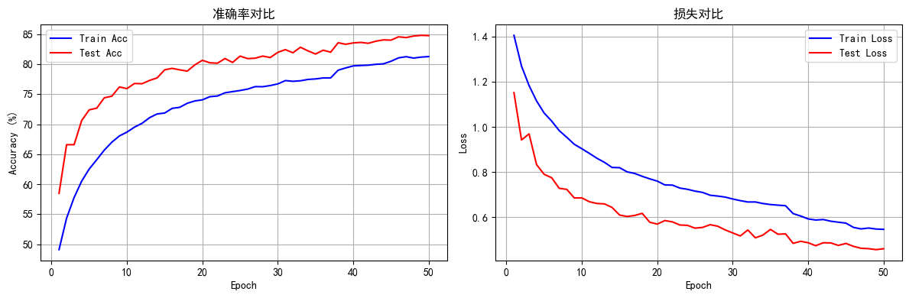
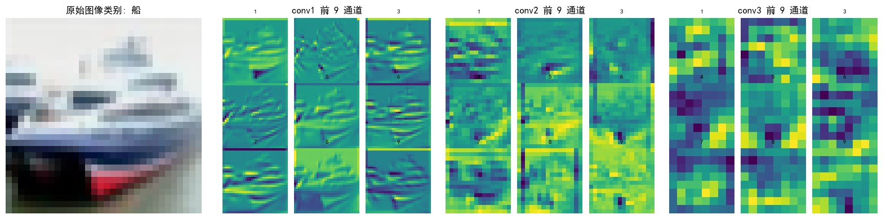
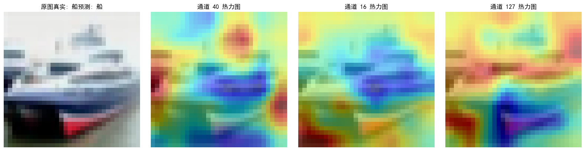

# Day 47 | 通道注意力（SE 注意力）


## 学习目标
> - 回顾注意力机制与通道注意力的定位
> - 训练基线 CNN，并可视化各卷积层特征图
> - 插入 SE 通道注意力模块，观察精度变化
> - 通过热力图理解模型关注的区域

## 1. 注意力回顾
- **注意力本质**：对特征加权求和，权重随输入动态变化（卷积权重是固定的）。
- **为何有多种注意力**：任务需求不同，通道/空间/自注意力等各司其职；计算成本与灵活性需要折衷。
- **通道注意力定位**：在“普通注意力”家族，目标是让模型知道“哪些通道更重要”，常与 CNN 配合使用。

## 2. 基线 CNN：数据与训练流程
1) 数据增强（训练集）+ 规范化（测试集）
2) 构建 CIFAR-10 DataLoader
3) 定义三层卷积的轻量 CNN
4) 训练 50 epoch，记录准确率/损失
5) 抽取中间层特征图便于可视化


```python
import torch
import torch.nn as nn
import torch.nn.functional as F
import torch.optim as optim
from torchvision import datasets, transforms
from torch.utils.data import DataLoader
import matplotlib.pyplot as plt
import numpy as np

plt.rcParams["font.family"] = ["SimHei"]
plt.rcParams['axes.unicode_minus'] = False

device = torch.device("cuda" if torch.cuda.is_available() else "cpu")
print(f"使用设备: {device}")
```

    使用设备: cuda


```python
# 数据增强：让模型更鲁棒
train_transform = transforms.Compose([
    transforms.RandomCrop(32, padding=4),
    transforms.RandomHorizontalFlip(),
    transforms.ColorJitter(brightness=0.2, contrast=0.2, saturation=0.2, hue=0.1),
    transforms.RandomRotation(15),
    transforms.ToTensor(),
    transforms.Normalize((0.4914, 0.4822, 0.4465), (0.2023, 0.1994, 0.2010)),
])

# 测试集只做规范化，保持分布一致
test_transform = transforms.Compose([
    transforms.ToTensor(),
    transforms.Normalize((0.4914, 0.4822, 0.4465), (0.2023, 0.1994, 0.2010)),
])

train_dataset = datasets.CIFAR10(root='./data', train=True, download=True, transform=train_transform)
test_dataset = datasets.CIFAR10(root='./data', train=False, transform=test_transform)

batch_size = 64
train_loader = DataLoader(train_dataset, batch_size=batch_size, shuffle=True)
test_loader = DataLoader(test_dataset, batch_size=batch_size, shuffle=False)

class_names = ['飞机', '汽车', '鸟', '猫', '鹿', '狗', '青蛙', '马', '船', '卡车']
```


```python
class CNN(nn.Module):
    """基线三层卷积 CNN，用作消融对比"""
    def __init__(self):
        super().__init__()
        # 卷积块 1：保持尺寸，提取低级纹理
        self.conv1 = nn.Conv2d(3, 32, 3, padding=1)
        self.bn1 = nn.BatchNorm2d(32)
        self.relu1 = nn.ReLU()
        self.pool1 = nn.MaxPool2d(2)

        # 卷积块 2：更深的纹理与局部组合
        self.conv2 = nn.Conv2d(32, 64, 3, padding=1)
        self.bn2 = nn.BatchNorm2d(64)
        self.relu2 = nn.ReLU()
        self.pool2 = nn.MaxPool2d(2)

        # 卷积块 3：抽象语义
        self.conv3 = nn.Conv2d(64, 128, 3, padding=1)
        self.bn3 = nn.BatchNorm2d(128)
        self.relu3 = nn.ReLU()
        self.pool3 = nn.MaxPool2d(2)

        # 分类头
        self.fc1 = nn.Linear(128 * 4 * 4, 512)
        self.dropout = nn.Dropout(p=0.5)
        self.fc2 = nn.Linear(512, 10)

    def forward(self, x):
        x = self.pool1(self.relu1(self.bn1(self.conv1(x))))
        x = self.pool2(self.relu2(self.bn2(self.conv2(x))))
        x = self.pool3(self.relu3(self.bn3(self.conv3(x))))
        x = x.view(-1, 128 * 4 * 4)
        x = self.dropout(self.relu3(self.fc1(x)))
        return self.fc2(x)

model = CNN().to(device)
criterion = nn.CrossEntropyLoss()
optimizer = optim.Adam(model.parameters(), lr=0.001)
scheduler = optim.lr_scheduler.ReduceLROnPlateau(optimizer, mode='min', patience=3, factor=0.5)
```


```python
def plot_iter_losses(losses, indices):
    plt.figure(figsize=(10, 4))
    plt.plot(indices, losses, 'b-', alpha=0.7, label='Iteration Loss')
    plt.xlabel('Iteration')
    plt.ylabel('Loss')
    plt.title('每个 Iteration 的训练损失')
    plt.legend(); plt.grid(True); plt.tight_layout(); plt.show()

def plot_epoch_metrics(train_acc, test_acc, train_loss, test_loss):
    epochs = range(1, len(train_acc) + 1)
    plt.figure(figsize=(12, 4))

    plt.subplot(1, 2, 1)
    plt.plot(epochs, train_acc, 'b-', label='Train Acc')
    plt.plot(epochs, test_acc, 'r-', label='Test Acc')
    plt.xlabel('Epoch'); plt.ylabel('Accuracy (%)'); plt.title('准确率对比'); plt.legend(); plt.grid(True)

    plt.subplot(1, 2, 2)
    plt.plot(epochs, train_loss, 'b-', label='Train Loss')
    plt.plot(epochs, test_loss, 'r-', label='Test Loss')
    plt.xlabel('Epoch'); plt.ylabel('Loss'); plt.title('损失对比'); plt.legend(); plt.grid(True)

    plt.tight_layout(); plt.show()

def train(model, train_loader, test_loader, criterion, optimizer, scheduler, device, epochs):
    model.train()
    all_iter_losses, iter_indices = [], []
    train_acc_history, test_acc_history = [], []
    train_loss_history, test_loss_history = [], []

    for epoch in range(epochs):
        running_loss = 0.0
        correct = total = 0

        for batch_idx, (data, target) in enumerate(train_loader):
            data, target = data.to(device), target.to(device)
            optimizer.zero_grad()
            output = model(data)
            loss = criterion(output, target)
            loss.backward()
            optimizer.step()

            iter_loss = loss.item()
            all_iter_losses.append(iter_loss)
            iter_indices.append(epoch * len(train_loader) + batch_idx + 1)

            running_loss += iter_loss
            _, predicted = output.max(1)
            total += target.size(0)
            correct += predicted.eq(target).sum().item()

            if (batch_idx + 1) % 100 == 0:
                print(f'Epoch {epoch+1}/{epochs} | Batch {batch_idx+1}/{len(train_loader)} | 损失: {iter_loss:.4f}')

        epoch_train_loss = running_loss / len(train_loader)
        epoch_train_acc = 100. * correct / total
        train_acc_history.append(epoch_train_acc)
        train_loss_history.append(epoch_train_loss)

        model.eval()
        test_loss = correct_test = total_test = 0
        with torch.no_grad():
            for data, target in test_loader:
                data, target = data.to(device), target.to(device)
                output = model(data)
                test_loss += criterion(output, target).item()
                _, predicted = output.max(1)
                total_test += target.size(0)
                correct_test += predicted.eq(target).sum().item()

        epoch_test_loss = test_loss / len(test_loader)
        epoch_test_acc = 100. * correct_test / total_test
        test_acc_history.append(epoch_test_acc)
        test_loss_history.append(epoch_test_loss)

        scheduler.step(epoch_test_loss)
        model.train()
        print(f'Epoch {epoch+1}/{epochs} 完成 | 训练 Acc: {epoch_train_acc:.2f}% | 测试 Acc: {epoch_test_acc:.2f}%')

    plot_iter_losses(all_iter_losses, iter_indices)
    plot_epoch_metrics(train_acc_history, test_acc_history, train_loss_history, test_loss_history)
    return test_acc_history[-1]

print("开始训练基线 CNN...")
baseline_acc = train(model, train_loader, test_loader, criterion, optimizer, scheduler, device, epochs=50)
print(f"训练完成，测试准确率: {baseline_acc:.2f}%")
```

    开始训练基线 CNN...
    Epoch 1/50 | Batch 100/782 | 损失: 1.5795
    Epoch 1/50 | Batch 200/782 | 损失: 1.1964
    Epoch 1/50 | Batch 300/782 | 损失: 1.5032
    Epoch 1/50 | Batch 400/782 | 损失: 1.3054
    Epoch 1/50 | Batch 500/782 | 损失: 1.3953
    Epoch 1/50 | Batch 600/782 | 损失: 1.4067
    Epoch 1/50 | Batch 700/782 | 损失: 1.1457
    Epoch 1/50 完成 | 训练 Acc: 49.12% | 测试 Acc: 58.49%
    Epoch 2/50 | Batch 100/782 | 损失: 1.2697
    Epoch 2/50 | Batch 200/782 | 损失: 1.4193
    Epoch 2/50 | Batch 300/782 | 损失: 1.0323
    Epoch 2/50 | Batch 400/782 | 损失: 1.2884
    Epoch 2/50 | Batch 500/782 | 损失: 1.2777
    Epoch 2/50 | Batch 600/782 | 损失: 1.1859
    Epoch 2/50 | Batch 700/782 | 损失: 1.3310
    Epoch 2/50 完成 | 训练 Acc: 54.36% | 测试 Acc: 66.58%
    Epoch 3/50 | Batch 100/782 | 损失: 1.2491
    Epoch 3/50 | Batch 200/782 | 损失: 1.0914
    Epoch 3/50 | Batch 300/782 | 损失: 1.0224
    Epoch 3/50 | Batch 400/782 | 损失: 1.2061
    Epoch 3/50 | Batch 500/782 | 损失: 1.0037
    Epoch 3/50 | Batch 600/782 | 损失: 1.2494
    Epoch 3/50 | Batch 700/782 | 损失: 0.9814
    Epoch 3/50 完成 | 训练 Acc: 57.80% | 测试 Acc: 66.59%
    Epoch 4/50 | Batch 100/782 | 损失: 1.0686
    Epoch 4/50 | Batch 200/782 | 损失: 0.9942
    Epoch 4/50 | Batch 300/782 | 损失: 1.2243
    Epoch 4/50 | Batch 400/782 | 损失: 1.2671
    Epoch 4/50 | Batch 500/782 | 损失: 1.0655
    Epoch 4/50 | Batch 600/782 | 损失: 0.9956
    Epoch 4/50 | Batch 700/782 | 损失: 1.2377
    Epoch 4/50 完成 | 训练 Acc: 60.52% | 测试 Acc: 70.60%
    Epoch 5/50 | Batch 100/782 | 损失: 1.1657
    Epoch 5/50 | Batch 200/782 | 损失: 1.1712
    Epoch 5/50 | Batch 300/782 | 损失: 1.2542
    Epoch 5/50 | Batch 400/782 | 损失: 1.4088
    Epoch 5/50 | Batch 500/782 | 损失: 0.9925
    Epoch 5/50 | Batch 600/782 | 损失: 0.9346
    Epoch 5/50 | Batch 700/782 | 损失: 1.0435
    Epoch 5/50 完成 | 训练 Acc: 62.54% | 测试 Acc: 72.38%
    Epoch 6/50 | Batch 100/782 | 损失: 1.1666
    Epoch 6/50 | Batch 200/782 | 损失: 1.0663
    Epoch 6/50 | Batch 300/782 | 损失: 1.1710
    Epoch 6/50 | Batch 400/782 | 损失: 1.0705
    Epoch 6/50 | Batch 500/782 | 损失: 1.1807
    Epoch 6/50 | Batch 600/782 | 损失: 1.0082
    Epoch 6/50 | Batch 700/782 | 损失: 1.0368
    Epoch 6/50 完成 | 训练 Acc: 64.09% | 测试 Acc: 72.67%
    Epoch 7/50 | Batch 100/782 | 损失: 1.1394
    Epoch 7/50 | Batch 200/782 | 损失: 1.0816
    Epoch 7/50 | Batch 300/782 | 损失: 1.0438
    Epoch 7/50 | Batch 400/782 | 损失: 0.9760
    Epoch 7/50 | Batch 500/782 | 损失: 0.9759
    Epoch 7/50 | Batch 600/782 | 损失: 0.9663
    Epoch 7/50 | Batch 700/782 | 损失: 0.9272
    Epoch 7/50 完成 | 训练 Acc: 65.68% | 测试 Acc: 74.39%
    Epoch 8/50 | Batch 100/782 | 损失: 1.0439
    Epoch 8/50 | Batch 200/782 | 损失: 1.0074
    Epoch 8/50 | Batch 300/782 | 损失: 0.9786
    Epoch 8/50 | Batch 400/782 | 损失: 0.9191
    Epoch 8/50 | Batch 500/782 | 损失: 0.8555
    Epoch 8/50 | Batch 600/782 | 损失: 1.1940
    Epoch 8/50 | Batch 700/782 | 损失: 0.7795
    Epoch 8/50 完成 | 训练 Acc: 67.00% | 测试 Acc: 74.66%
    Epoch 9/50 | Batch 100/782 | 损失: 1.1164
    Epoch 9/50 | Batch 200/782 | 损失: 1.0227
    Epoch 9/50 | Batch 300/782 | 损失: 0.9331
    Epoch 9/50 | Batch 400/782 | 损失: 0.7620
    Epoch 9/50 | Batch 500/782 | 损失: 0.9530
    Epoch 9/50 | Batch 600/782 | 损失: 1.1269
    Epoch 9/50 | Batch 700/782 | 损失: 1.0045
    Epoch 9/50 完成 | 训练 Acc: 68.04% | 测试 Acc: 76.19%
    Epoch 10/50 | Batch 100/782 | 损失: 0.8848
    Epoch 10/50 | Batch 200/782 | 损失: 1.0696
    Epoch 10/50 | Batch 300/782 | 损失: 1.1073
    Epoch 10/50 | Batch 400/782 | 损失: 1.0234
    Epoch 10/50 | Batch 500/782 | 损失: 1.0716
    Epoch 10/50 | Batch 600/782 | 损失: 1.0042
    Epoch 10/50 | Batch 700/782 | 损失: 0.7872
    Epoch 10/50 完成 | 训练 Acc: 68.68% | 测试 Acc: 75.92%
    Epoch 11/50 | Batch 100/782 | 损失: 0.7872
    Epoch 11/50 | Batch 200/782 | 损失: 0.6823
    Epoch 11/50 | Batch 300/782 | 损失: 0.8683
    Epoch 11/50 | Batch 400/782 | 损失: 0.7940
    Epoch 11/50 | Batch 500/782 | 损失: 1.1547
    Epoch 11/50 | Batch 600/782 | 损失: 0.7433
    Epoch 11/50 | Batch 700/782 | 损失: 0.9487
    Epoch 11/50 完成 | 训练 Acc: 69.51% | 测试 Acc: 76.77%
    Epoch 12/50 | Batch 100/782 | 损失: 0.8050
    Epoch 12/50 | Batch 200/782 | 损失: 0.7316
    Epoch 12/50 | Batch 300/782 | 损失: 1.0671
    Epoch 12/50 | Batch 400/782 | 损失: 0.9045
    Epoch 12/50 | Batch 500/782 | 损失: 1.0913
    Epoch 12/50 | Batch 600/782 | 损失: 0.8779
    Epoch 12/50 | Batch 700/782 | 损失: 0.8409
    Epoch 12/50 完成 | 训练 Acc: 70.14% | 测试 Acc: 76.73%
    Epoch 13/50 | Batch 100/782 | 损失: 0.8441
    Epoch 13/50 | Batch 200/782 | 损失: 0.7837
    Epoch 13/50 | Batch 300/782 | 损失: 0.6823
    Epoch 13/50 | Batch 400/782 | 损失: 0.6380
    Epoch 13/50 | Batch 500/782 | 损失: 0.7371
    Epoch 13/50 | Batch 600/782 | 损失: 0.7884
    Epoch 13/50 | Batch 700/782 | 损失: 0.7778
    Epoch 13/50 完成 | 训练 Acc: 71.08% | 测试 Acc: 77.28%
    Epoch 14/50 | Batch 100/782 | 损失: 0.9162
    Epoch 14/50 | Batch 200/782 | 损失: 0.5237
    Epoch 14/50 | Batch 300/782 | 损失: 0.6949
    Epoch 14/50 | Batch 400/782 | 损失: 0.6769
    Epoch 14/50 | Batch 500/782 | 损失: 0.7937
    Epoch 14/50 | Batch 600/782 | 损失: 0.8347
    Epoch 14/50 | Batch 700/782 | 损失: 0.8496
    Epoch 14/50 完成 | 训练 Acc: 71.70% | 测试 Acc: 77.70%
    Epoch 15/50 | Batch 100/782 | 损失: 0.7741
    Epoch 15/50 | Batch 200/782 | 损失: 0.5172
    Epoch 15/50 | Batch 300/782 | 损失: 0.7767
    Epoch 15/50 | Batch 400/782 | 损失: 0.7409
    Epoch 15/50 | Batch 500/782 | 损失: 1.0637
    Epoch 15/50 | Batch 600/782 | 损失: 0.9893
    Epoch 15/50 | Batch 700/782 | 损失: 0.8728
    Epoch 15/50 完成 | 训练 Acc: 71.86% | 测试 Acc: 79.05%
    Epoch 16/50 | Batch 100/782 | 损失: 0.7729
    Epoch 16/50 | Batch 200/782 | 损失: 0.7353
    Epoch 16/50 | Batch 300/782 | 损失: 0.8444
    Epoch 16/50 | Batch 400/782 | 损失: 1.0207
    Epoch 16/50 | Batch 500/782 | 损失: 0.8382
    Epoch 16/50 | Batch 600/782 | 损失: 0.8000
    Epoch 16/50 | Batch 700/782 | 损失: 0.8832
    Epoch 16/50 完成 | 训练 Acc: 72.63% | 测试 Acc: 79.29%
    Epoch 17/50 | Batch 100/782 | 损失: 0.6372
    Epoch 17/50 | Batch 200/782 | 损失: 0.7702
    Epoch 17/50 | Batch 300/782 | 损失: 0.6873
    Epoch 17/50 | Batch 400/782 | 损失: 0.7557
    Epoch 17/50 | Batch 500/782 | 损失: 0.8661
    Epoch 17/50 | Batch 600/782 | 损失: 0.7774
    Epoch 17/50 | Batch 700/782 | 损失: 0.5581
    Epoch 17/50 完成 | 训练 Acc: 72.81% | 测试 Acc: 79.04%
    Epoch 18/50 | Batch 100/782 | 损失: 0.7691
    Epoch 18/50 | Batch 200/782 | 损失: 0.7174
    Epoch 18/50 | Batch 300/782 | 损失: 0.8377
    Epoch 18/50 | Batch 400/782 | 损失: 0.8496
    Epoch 18/50 | Batch 500/782 | 损失: 0.5467
    Epoch 18/50 | Batch 600/782 | 损失: 0.8743
    Epoch 18/50 | Batch 700/782 | 损失: 0.8725
    Epoch 18/50 完成 | 训练 Acc: 73.48% | 测试 Acc: 78.83%
    Epoch 19/50 | Batch 100/782 | 损失: 0.8853
    Epoch 19/50 | Batch 200/782 | 损失: 0.6908
    Epoch 19/50 | Batch 300/782 | 损失: 0.6833
    Epoch 19/50 | Batch 400/782 | 损失: 0.8460
    Epoch 19/50 | Batch 500/782 | 损失: 0.5044
    Epoch 19/50 | Batch 600/782 | 损失: 0.8951
    Epoch 19/50 | Batch 700/782 | 损失: 0.3646
    Epoch 19/50 完成 | 训练 Acc: 73.87% | 测试 Acc: 79.87%
    Epoch 20/50 | Batch 100/782 | 损失: 0.6390
    Epoch 20/50 | Batch 200/782 | 损失: 0.7750
    Epoch 20/50 | Batch 300/782 | 损失: 0.7555
    Epoch 20/50 | Batch 400/782 | 损失: 0.9045
    Epoch 20/50 | Batch 500/782 | 损失: 0.7936
    Epoch 20/50 | Batch 600/782 | 损失: 0.6205
    Epoch 20/50 | Batch 700/782 | 损失: 0.9813
    Epoch 20/50 完成 | 训练 Acc: 74.05% | 测试 Acc: 80.63%
    Epoch 21/50 | Batch 100/782 | 损失: 1.0088
    Epoch 21/50 | Batch 200/782 | 损失: 0.8719
    Epoch 21/50 | Batch 300/782 | 损失: 0.6698
    Epoch 21/50 | Batch 400/782 | 损失: 0.6587
    Epoch 21/50 | Batch 500/782 | 损失: 0.6132
    Epoch 21/50 | Batch 600/782 | 损失: 0.8197
    Epoch 21/50 | Batch 700/782 | 损失: 0.8097
    Epoch 21/50 完成 | 训练 Acc: 74.58% | 测试 Acc: 80.21%
    Epoch 22/50 | Batch 100/782 | 损失: 0.5132
    Epoch 22/50 | Batch 200/782 | 损失: 0.9136
    Epoch 22/50 | Batch 300/782 | 损失: 0.4226
    Epoch 22/50 | Batch 400/782 | 损失: 0.9402
    Epoch 22/50 | Batch 500/782 | 损失: 0.5551
    Epoch 22/50 | Batch 600/782 | 损失: 0.7204
    Epoch 22/50 | Batch 700/782 | 损失: 0.8022
    Epoch 22/50 完成 | 训练 Acc: 74.69% | 测试 Acc: 80.15%
    Epoch 23/50 | Batch 100/782 | 损失: 0.7692
    Epoch 23/50 | Batch 200/782 | 损失: 0.8515
    Epoch 23/50 | Batch 300/782 | 损失: 0.7415
    Epoch 23/50 | Batch 400/782 | 损失: 0.6486
    Epoch 23/50 | Batch 500/782 | 损失: 0.5870
    Epoch 23/50 | Batch 600/782 | 损失: 0.8938
    Epoch 23/50 | Batch 700/782 | 损失: 0.7308
    Epoch 23/50 完成 | 训练 Acc: 75.22% | 测试 Acc: 80.92%
    Epoch 24/50 | Batch 100/782 | 损失: 0.7182
    Epoch 24/50 | Batch 200/782 | 损失: 0.8027
    Epoch 24/50 | Batch 300/782 | 损失: 0.6615
    Epoch 24/50 | Batch 400/782 | 损失: 0.7313
    Epoch 24/50 | Batch 500/782 | 损失: 0.6881
    Epoch 24/50 | Batch 600/782 | 损失: 0.8652
    Epoch 24/50 | Batch 700/782 | 损失: 0.7462
    Epoch 24/50 完成 | 训练 Acc: 75.42% | 测试 Acc: 80.27%
    Epoch 25/50 | Batch 100/782 | 损失: 0.7423
    Epoch 25/50 | Batch 200/782 | 损失: 0.8292
    Epoch 25/50 | Batch 300/782 | 损失: 0.6078
    Epoch 25/50 | Batch 400/782 | 损失: 0.7622
    Epoch 25/50 | Batch 500/782 | 损失: 0.8759
    Epoch 25/50 | Batch 600/782 | 损失: 0.7101
    Epoch 25/50 | Batch 700/782 | 损失: 0.6792
    Epoch 25/50 完成 | 训练 Acc: 75.60% | 测试 Acc: 81.33%
    Epoch 26/50 | Batch 100/782 | 损失: 0.7153
    Epoch 26/50 | Batch 200/782 | 损失: 0.7061
    Epoch 26/50 | Batch 300/782 | 损失: 0.8497
    Epoch 26/50 | Batch 400/782 | 损失: 0.6317
    Epoch 26/50 | Batch 500/782 | 损失: 0.5145
    Epoch 26/50 | Batch 600/782 | 损失: 0.7997
    Epoch 26/50 | Batch 700/782 | 损失: 0.5410
    Epoch 26/50 完成 | 训练 Acc: 75.84% | 测试 Acc: 80.91%
    Epoch 27/50 | Batch 100/782 | 损失: 1.0264
    Epoch 27/50 | Batch 200/782 | 损失: 0.7800
    Epoch 27/50 | Batch 300/782 | 损失: 0.6448
    Epoch 27/50 | Batch 400/782 | 损失: 0.9183
    Epoch 27/50 | Batch 500/782 | 损失: 0.5724
    Epoch 27/50 | Batch 600/782 | 损失: 0.6970
    Epoch 27/50 | Batch 700/782 | 损失: 0.6597
    Epoch 27/50 完成 | 训练 Acc: 76.25% | 测试 Acc: 80.98%
    Epoch 28/50 | Batch 100/782 | 损失: 0.6677
    Epoch 28/50 | Batch 200/782 | 损失: 0.9284
    Epoch 28/50 | Batch 300/782 | 损失: 0.7410
    Epoch 28/50 | Batch 400/782 | 损失: 0.7506
    Epoch 28/50 | Batch 500/782 | 损失: 0.5823
    Epoch 28/50 | Batch 600/782 | 损失: 0.7406
    Epoch 28/50 | Batch 700/782 | 损失: 0.5580
    Epoch 28/50 完成 | 训练 Acc: 76.23% | 测试 Acc: 81.33%
    Epoch 29/50 | Batch 100/782 | 损失: 0.6176
    Epoch 29/50 | Batch 200/782 | 损失: 0.6056
    Epoch 29/50 | Batch 300/782 | 损失: 0.8757
    Epoch 29/50 | Batch 400/782 | 损失: 0.6017
    Epoch 29/50 | Batch 500/782 | 损失: 0.8869
    Epoch 29/50 | Batch 600/782 | 损失: 1.0562
    Epoch 29/50 | Batch 700/782 | 损失: 0.5842
    Epoch 29/50 完成 | 训练 Acc: 76.43% | 测试 Acc: 81.09%
    Epoch 30/50 | Batch 100/782 | 损失: 0.7530
    Epoch 30/50 | Batch 200/782 | 损失: 0.8299
    Epoch 30/50 | Batch 300/782 | 损失: 0.6937
    Epoch 30/50 | Batch 400/782 | 损失: 0.6277
    Epoch 30/50 | Batch 500/782 | 损失: 0.8707
    Epoch 30/50 | Batch 600/782 | 损失: 0.9732
    Epoch 30/50 | Batch 700/782 | 损失: 0.6765
    Epoch 30/50 完成 | 训练 Acc: 76.70% | 测试 Acc: 81.95%
    Epoch 31/50 | Batch 100/782 | 损失: 0.7592
    Epoch 31/50 | Batch 200/782 | 损失: 0.7820
    Epoch 31/50 | Batch 300/782 | 损失: 0.6682
    Epoch 31/50 | Batch 400/782 | 损失: 0.7254
    Epoch 31/50 | Batch 500/782 | 损失: 0.5039
    Epoch 31/50 | Batch 600/782 | 损失: 0.4498
    Epoch 31/50 | Batch 700/782 | 损失: 0.5863
    Epoch 31/50 完成 | 训练 Acc: 77.25% | 测试 Acc: 82.41%
    Epoch 32/50 | Batch 100/782 | 损失: 0.7035
    Epoch 32/50 | Batch 200/782 | 损失: 0.5068
    Epoch 32/50 | Batch 300/782 | 损失: 0.6894
    Epoch 32/50 | Batch 400/782 | 损失: 0.7365
    Epoch 32/50 | Batch 500/782 | 损失: 0.7099
    Epoch 32/50 | Batch 600/782 | 损失: 0.3558
    Epoch 32/50 | Batch 700/782 | 损失: 0.4951
    Epoch 32/50 完成 | 训练 Acc: 77.13% | 测试 Acc: 81.88%
    Epoch 33/50 | Batch 100/782 | 损失: 0.4330
    Epoch 33/50 | Batch 200/782 | 损失: 0.8384
    Epoch 33/50 | Batch 300/782 | 损失: 0.5116
    Epoch 33/50 | Batch 400/782 | 损失: 0.4891
    Epoch 33/50 | Batch 500/782 | 损失: 0.8064
    Epoch 33/50 | Batch 600/782 | 损失: 0.7711
    Epoch 33/50 | Batch 700/782 | 损失: 0.7383
    Epoch 33/50 完成 | 训练 Acc: 77.22% | 测试 Acc: 82.80%
    Epoch 34/50 | Batch 100/782 | 损失: 0.8224
    Epoch 34/50 | Batch 200/782 | 损失: 0.4602
    Epoch 34/50 | Batch 300/782 | 损失: 0.5356
    Epoch 34/50 | Batch 400/782 | 损失: 0.6048
    Epoch 34/50 | Batch 500/782 | 损失: 0.7092
    Epoch 34/50 | Batch 600/782 | 损失: 0.5986
    Epoch 34/50 | Batch 700/782 | 损失: 0.5254
    Epoch 34/50 完成 | 训练 Acc: 77.45% | 测试 Acc: 82.20%
    Epoch 35/50 | Batch 100/782 | 损失: 0.4990
    Epoch 35/50 | Batch 200/782 | 损失: 0.6372
    Epoch 35/50 | Batch 300/782 | 损失: 0.7056
    Epoch 35/50 | Batch 400/782 | 损失: 0.7399
    Epoch 35/50 | Batch 500/782 | 损失: 0.5673
    Epoch 35/50 | Batch 600/782 | 损失: 0.7454
    Epoch 35/50 | Batch 700/782 | 损失: 0.5100
    Epoch 35/50 完成 | 训练 Acc: 77.53% | 测试 Acc: 81.67%
    Epoch 36/50 | Batch 100/782 | 损失: 0.6396
    Epoch 36/50 | Batch 200/782 | 损失: 0.8249
    Epoch 36/50 | Batch 300/782 | 损失: 0.5231
    Epoch 36/50 | Batch 400/782 | 损失: 0.6586
    Epoch 36/50 | Batch 500/782 | 损失: 0.7599
    Epoch 36/50 | Batch 600/782 | 损失: 0.8488
    Epoch 36/50 | Batch 700/782 | 损失: 0.9112
    Epoch 36/50 完成 | 训练 Acc: 77.69% | 测试 Acc: 82.31%
    Epoch 37/50 | Batch 100/782 | 损失: 0.5737
    Epoch 37/50 | Batch 200/782 | 损失: 0.7579
    Epoch 37/50 | Batch 300/782 | 损失: 0.5552
    Epoch 37/50 | Batch 400/782 | 损失: 0.5266
    Epoch 37/50 | Batch 500/782 | 损失: 0.4903
    Epoch 37/50 | Batch 600/782 | 损失: 0.5368
    Epoch 37/50 | Batch 700/782 | 损失: 0.9100
    Epoch 37/50 完成 | 训练 Acc: 77.70% | 测试 Acc: 81.98%
    Epoch 38/50 | Batch 100/782 | 损失: 0.5714
    Epoch 38/50 | Batch 200/782 | 损失: 0.4654
    Epoch 38/50 | Batch 300/782 | 损失: 0.8505
    Epoch 38/50 | Batch 400/782 | 损失: 0.6088
    Epoch 38/50 | Batch 500/782 | 损失: 0.5548
    Epoch 38/50 | Batch 600/782 | 损失: 0.5653
    Epoch 38/50 | Batch 700/782 | 损失: 0.3828
    Epoch 38/50 完成 | 训练 Acc: 78.99% | 测试 Acc: 83.55%
    Epoch 39/50 | Batch 100/782 | 损失: 0.7363
    Epoch 39/50 | Batch 200/782 | 损失: 0.4453
    Epoch 39/50 | Batch 300/782 | 损失: 0.6107
    Epoch 39/50 | Batch 400/782 | 损失: 0.7012
    Epoch 39/50 | Batch 500/782 | 损失: 0.6176
    Epoch 39/50 | Batch 600/782 | 损失: 0.5164
    Epoch 39/50 | Batch 700/782 | 损失: 0.4798
    Epoch 39/50 完成 | 训练 Acc: 79.36% | 测试 Acc: 83.30%
    Epoch 40/50 | Batch 100/782 | 损失: 0.5990
    Epoch 40/50 | Batch 200/782 | 损失: 0.6155
    Epoch 40/50 | Batch 300/782 | 损失: 0.6642
    Epoch 40/50 | Batch 400/782 | 损失: 0.5379
    Epoch 40/50 | Batch 500/782 | 损失: 0.6064
    Epoch 40/50 | Batch 600/782 | 损失: 0.7216
    Epoch 40/50 | Batch 700/782 | 损失: 0.4762
    Epoch 40/50 完成 | 训练 Acc: 79.70% | 测试 Acc: 83.52%
    Epoch 41/50 | Batch 100/782 | 损失: 0.4923
    Epoch 41/50 | Batch 200/782 | 损失: 0.5550
    Epoch 41/50 | Batch 300/782 | 损失: 0.4197
    Epoch 41/50 | Batch 400/782 | 损失: 0.6071
    Epoch 41/50 | Batch 500/782 | 损失: 0.6548
    Epoch 41/50 | Batch 600/782 | 损失: 0.4523
    Epoch 41/50 | Batch 700/782 | 损失: 0.5019
    Epoch 41/50 完成 | 训练 Acc: 79.77% | 测试 Acc: 83.61%
    Epoch 42/50 | Batch 100/782 | 损失: 0.5560
    Epoch 42/50 | Batch 200/782 | 损失: 0.6471
    Epoch 42/50 | Batch 300/782 | 损失: 0.5068
    Epoch 42/50 | Batch 400/782 | 损失: 0.5422
    Epoch 42/50 | Batch 500/782 | 损失: 0.5728
    Epoch 42/50 | Batch 600/782 | 损失: 0.3037
    Epoch 42/50 | Batch 700/782 | 损失: 0.5770
    Epoch 42/50 完成 | 训练 Acc: 79.82% | 测试 Acc: 83.46%
    Epoch 43/50 | Batch 100/782 | 损失: 0.7175
    Epoch 43/50 | Batch 200/782 | 损失: 0.8121
    Epoch 43/50 | Batch 300/782 | 损失: 0.8290
    Epoch 43/50 | Batch 400/782 | 损失: 0.6091
    Epoch 43/50 | Batch 500/782 | 损失: 0.5397
    Epoch 43/50 | Batch 600/782 | 损失: 0.4780
    Epoch 43/50 | Batch 700/782 | 损失: 0.4065
    Epoch 43/50 完成 | 训练 Acc: 79.96% | 测试 Acc: 83.81%
    Epoch 44/50 | Batch 100/782 | 损失: 0.5971
    Epoch 44/50 | Batch 200/782 | 损失: 0.8163
    Epoch 44/50 | Batch 300/782 | 损失: 0.6225
    Epoch 44/50 | Batch 400/782 | 损失: 0.4263
    Epoch 44/50 | Batch 500/782 | 损失: 0.4591
    Epoch 44/50 | Batch 600/782 | 损失: 0.6566
    Epoch 44/50 | Batch 700/782 | 损失: 0.2507
    Epoch 44/50 完成 | 训练 Acc: 80.04% | 测试 Acc: 84.03%
    Epoch 45/50 | Batch 100/782 | 损失: 0.4625
    Epoch 45/50 | Batch 200/782 | 损失: 0.5148
    Epoch 45/50 | Batch 300/782 | 损失: 0.5144
    Epoch 45/50 | Batch 400/782 | 损失: 0.5415
    Epoch 45/50 | Batch 500/782 | 损失: 0.5773
    Epoch 45/50 | Batch 600/782 | 损失: 0.7074
    Epoch 45/50 | Batch 700/782 | 损失: 0.4974
    Epoch 45/50 完成 | 训练 Acc: 80.47% | 测试 Acc: 83.98%
    Epoch 46/50 | Batch 100/782 | 损失: 0.7269
    Epoch 46/50 | Batch 200/782 | 损失: 0.5524
    Epoch 46/50 | Batch 300/782 | 损失: 0.4739
    Epoch 46/50 | Batch 400/782 | 损失: 0.5137
    Epoch 46/50 | Batch 500/782 | 损失: 0.5897
    Epoch 46/50 | Batch 600/782 | 损失: 0.6878
    Epoch 46/50 | Batch 700/782 | 损失: 0.3499
    Epoch 46/50 完成 | 训练 Acc: 81.03% | 测试 Acc: 84.54%
    Epoch 47/50 | Batch 100/782 | 损失: 0.4277
    Epoch 47/50 | Batch 200/782 | 损失: 0.4134
    Epoch 47/50 | Batch 300/782 | 损失: 0.4892
    Epoch 47/50 | Batch 400/782 | 损失: 0.6161
    Epoch 47/50 | Batch 500/782 | 损失: 0.4558
    Epoch 47/50 | Batch 600/782 | 损失: 0.5716
    Epoch 47/50 | Batch 700/782 | 损失: 0.3637
    Epoch 47/50 完成 | 训练 Acc: 81.23% | 测试 Acc: 84.41%
    Epoch 48/50 | Batch 100/782 | 损失: 0.6052
    Epoch 48/50 | Batch 200/782 | 损失: 0.6030
    Epoch 48/50 | Batch 300/782 | 损失: 0.9375
    Epoch 48/50 | Batch 400/782 | 损失: 0.5343
    Epoch 48/50 | Batch 500/782 | 损失: 0.4600
    Epoch 48/50 | Batch 600/782 | 损失: 0.5426
    Epoch 48/50 | Batch 700/782 | 损失: 0.6336
    Epoch 48/50 完成 | 训练 Acc: 81.00% | 测试 Acc: 84.67%
    Epoch 49/50 | Batch 100/782 | 损失: 0.3297
    Epoch 49/50 | Batch 200/782 | 损失: 0.5549
    Epoch 49/50 | Batch 300/782 | 损失: 0.5713
    Epoch 49/50 | Batch 400/782 | 损失: 0.3993
    Epoch 49/50 | Batch 500/782 | 损失: 0.5168
    Epoch 49/50 | Batch 600/782 | 损失: 0.4553
    Epoch 49/50 | Batch 700/782 | 损失: 0.7744
    Epoch 49/50 完成 | 训练 Acc: 81.16% | 测试 Acc: 84.78%
    Epoch 50/50 | Batch 100/782 | 损失: 0.6591
    Epoch 50/50 | Batch 200/782 | 损失: 0.6315
    Epoch 50/50 | Batch 300/782 | 损失: 0.6947
    Epoch 50/50 | Batch 400/782 | 损失: 0.7310
    Epoch 50/50 | Batch 500/782 | 损失: 0.4123
    Epoch 50/50 | Batch 600/782 | 损失: 0.6256
    Epoch 50/50 | Batch 700/782 | 损失: 0.6132
    Epoch 50/50 完成 | 训练 Acc: 81.25% | 测试 Acc: 84.74%


    

    


    

    


    训练完成，测试准确率: 84.74%


## 3. 卷积层特征图可视化
步骤：
1. 为目标层注册 forward hook 捕获输出
2. 取少量样本前向传播
3. 展示每层前若干通道的特征图，与原图对齐

小贴士：浅层更像“纹理/边缘”，深层更抽象更难解读。


```python
def visualize_feature_maps(model, test_loader, device, layer_names, num_images=3, num_channels=9):
    model.eval()
    images_list, labels_list = [], []
    for images, labels in test_loader:
        images_list.append(images)
        labels_list.append(labels)
        if len(images_list) * test_loader.batch_size >= num_images:
            break
    images = torch.cat(images_list, dim=0)[:num_images].to(device)
    labels = torch.cat(labels_list, dim=0)[:num_images].to(device)

    feature_maps = {}
    hooks = []
    def hook(module, input, output, name):
        feature_maps[name] = output.cpu()
    for name in layer_names:
        module = getattr(model, name)
        hooks.append(module.register_forward_hook(lambda m, i, o, n=name: hook(m, i, o, n)))

    _ = model(images)
    for h in hooks:
        h.remove()

    for img_idx in range(num_images):
        img = images[img_idx].cpu().permute(1, 2, 0).numpy()
        img = img * np.array([0.2023, 0.1994, 0.2010]).reshape(1, 1, 3) + np.array([0.4914, 0.4822, 0.4465]).reshape(1, 1, 3)
        img = np.clip(img, 0, 1)

        num_layers = len(layer_names)
        fig, axes = plt.subplots(1, num_layers + 1, figsize=(4 * (num_layers + 1), 4))

        axes[0].imshow(img)
        axes[0].set_title(f'原始图像类别: {class_names[labels[img_idx]]}')
        axes[0].axis('off')

        for layer_idx, layer_name in enumerate(layer_names):
            fm = feature_maps[layer_name][img_idx][:num_channels]
            num_rows = int(np.sqrt(num_channels))
            num_cols = num_channels // num_rows if num_rows else 1
            layer_ax = axes[layer_idx + 1]
            layer_ax.set_title(f'{layer_name} 前 {num_channels} 通道')
            layer_ax.axis('off')
            for ch_idx, channel in enumerate(fm):
                ax = layer_ax.inset_axes([
                    ch_idx % num_cols / num_cols,
                    (num_rows - 1 - ch_idx // num_cols) / num_rows,
                    1 / num_cols,
                    1 / num_rows,
                ])
                ax.imshow(channel.detach().numpy(), cmap='viridis')
                ax.set_title(f'{ch_idx + 1}', fontsize=8)
                ax.axis('off')
        plt.tight_layout(); plt.show()

layer_names = ['conv1', 'conv2', 'conv3']
visualize_feature_maps(model, test_loader, device, layer_names, num_images=3, num_channels=9)
```


    

    


    

    


    

    


## 4. 通道注意力（SE）
核心流程：
1. **Squeeze**：全局平均池化得到每个通道的整体响应
2. **Excitation**：两层全连接学习通道权重（0-1）
3. **Re-weight**：按权重重标定特征图，强化重要通道，抑制无关通道

轻量、易插拔，适合与卷积块搭配。


```python
class ChannelAttention(nn.Module):
    """Squeeze-and-Excitation 通道注意力"""
    def __init__(self, in_channels, reduction_ratio=16):
        super().__init__()
        self.avg_pool = nn.AdaptiveAvgPool2d(1)
        self.fc = nn.Sequential(
            nn.Linear(in_channels, in_channels // reduction_ratio, bias=False),
            nn.ReLU(inplace=True),
            nn.Linear(in_channels // reduction_ratio, in_channels, bias=False),
            nn.Sigmoid(),
        )

    def forward(self, x):
        b, c, _, _ = x.size()
        y = self.avg_pool(x).view(b, c)
        y = self.fc(y).view(b, c, 1, 1)
        return x * y
```

### 4.1 将 SE 插入 CNN
- 在每个卷积块后加入 `ChannelAttention`
- 其余结构保持不变，便于做消融对比


```python
class CNNWithSE(nn.Module):
    def __init__(self):
        super().__init__()
        self.conv1 = nn.Conv2d(3, 32, 3, padding=1)
        self.bn1 = nn.BatchNorm2d(32)
        self.relu1 = nn.ReLU()
        self.ca1 = ChannelAttention(32)
        self.pool1 = nn.MaxPool2d(2)

        self.conv2 = nn.Conv2d(32, 64, 3, padding=1)
        self.bn2 = nn.BatchNorm2d(64)
        self.relu2 = nn.ReLU()
        self.ca2 = ChannelAttention(64)
        self.pool2 = nn.MaxPool2d(2)

        self.conv3 = nn.Conv2d(64, 128, 3, padding=1)
        self.bn3 = nn.BatchNorm2d(128)
        self.relu3 = nn.ReLU()
        self.ca3 = ChannelAttention(128)
        self.pool3 = nn.MaxPool2d(2)

        self.fc1 = nn.Linear(128 * 4 * 4, 512)
        self.dropout = nn.Dropout(p=0.5)
        self.fc2 = nn.Linear(512, 10)

    def forward(self, x):
        x = self.pool1(self.ca1(self.relu1(self.bn1(self.conv1(x)))))
        x = self.pool2(self.ca2(self.relu2(self.bn2(self.conv2(x)))))
        x = self.pool3(self.ca3(self.relu3(self.bn3(self.conv3(x)))))
        x = x.view(-1, 128 * 4 * 4)
        x = self.dropout(self.relu3(self.fc1(x)))
        return self.fc2(x)

model_se = CNNWithSE().to(device)
criterion = nn.CrossEntropyLoss()
optimizer = optim.Adam(model_se.parameters(), lr=0.001)
scheduler = optim.lr_scheduler.ReduceLROnPlateau(optimizer, mode='min', patience=3, factor=0.5)

print("开始训练带 SE 的 CNN...")
se_acc = train(model_se, train_loader, test_loader, criterion, optimizer, scheduler, device, epochs=50)
print(f"训练完成，测试准确率: {se_acc:.2f}%")
```

    开始训练带 SE 的 CNN...
    Epoch 1/50 | Batch 100/782 | 损失: 1.8605
    Epoch 1/50 | Batch 200/782 | 损失: 1.8923
    Epoch 1/50 | Batch 300/782 | 损失: 1.6465
    Epoch 1/50 | Batch 400/782 | 损失: 1.5320
    Epoch 1/50 | Batch 500/782 | 损失: 1.7046
    Epoch 1/50 | Batch 600/782 | 损失: 1.8581
    Epoch 1/50 | Batch 700/782 | 损失: 1.5583
    Epoch 1/50 完成 | 训练 Acc: 39.81% | 测试 Acc: 54.43%
    Epoch 2/50 | Batch 100/782 | 损失: 1.3893
    Epoch 2/50 | Batch 200/782 | 损失: 1.1986
    Epoch 2/50 | Batch 300/782 | 损失: 1.4215
    Epoch 2/50 | Batch 400/782 | 损失: 1.3086
    Epoch 2/50 | Batch 500/782 | 损失: 1.1896
    Epoch 2/50 | Batch 600/782 | 损失: 1.3483
    Epoch 2/50 | Batch 700/782 | 损失: 1.4361
    Epoch 2/50 完成 | 训练 Acc: 51.63% | 测试 Acc: 61.91%
    Epoch 3/50 | Batch 100/782 | 损失: 1.2829
    Epoch 3/50 | Batch 200/782 | 损失: 1.2434
    Epoch 3/50 | Batch 300/782 | 损失: 1.3499
    Epoch 3/50 | Batch 400/782 | 损失: 0.9461
    Epoch 3/50 | Batch 500/782 | 损失: 1.1925
    Epoch 3/50 | Batch 600/782 | 损失: 1.2802
    Epoch 3/50 | Batch 700/782 | 损失: 1.1045
    Epoch 3/50 完成 | 训练 Acc: 57.18% | 测试 Acc: 64.80%
    Epoch 4/50 | Batch 100/782 | 损失: 1.0941
    Epoch 4/50 | Batch 200/782 | 损失: 1.1868
    Epoch 4/50 | Batch 300/782 | 损失: 1.1628
    Epoch 4/50 | Batch 400/782 | 损失: 1.0128
    Epoch 4/50 | Batch 500/782 | 损失: 1.3685
    Epoch 4/50 | Batch 600/782 | 损失: 1.4004
    Epoch 4/50 | Batch 700/782 | 损失: 0.8870
    Epoch 4/50 完成 | 训练 Acc: 60.13% | 测试 Acc: 69.80%
    Epoch 5/50 | Batch 100/782 | 损失: 0.8406
    Epoch 5/50 | Batch 200/782 | 损失: 1.0050
    Epoch 5/50 | Batch 300/782 | 损失: 1.1468
    Epoch 5/50 | Batch 400/782 | 损失: 1.2448
    Epoch 5/50 | Batch 500/782 | 损失: 0.9438
    Epoch 5/50 | Batch 600/782 | 损失: 0.7732
    Epoch 5/50 | Batch 700/782 | 损失: 1.0888
    Epoch 5/50 完成 | 训练 Acc: 62.83% | 测试 Acc: 69.48%
    Epoch 6/50 | Batch 100/782 | 损失: 1.0734
    Epoch 6/50 | Batch 200/782 | 损失: 0.8906
    Epoch 6/50 | Batch 300/782 | 损失: 1.1628
    Epoch 6/50 | Batch 400/782 | 损失: 0.8935
    Epoch 6/50 | Batch 500/782 | 损失: 0.7936
    Epoch 6/50 | Batch 600/782 | 损失: 0.7992
    Epoch 6/50 | Batch 700/782 | 损失: 1.0155
    Epoch 6/50 完成 | 训练 Acc: 64.51% | 测试 Acc: 73.60%
    Epoch 7/50 | Batch 100/782 | 损失: 0.8364
    Epoch 7/50 | Batch 200/782 | 损失: 1.0380
    Epoch 7/50 | Batch 300/782 | 损失: 1.4014
    Epoch 7/50 | Batch 400/782 | 损失: 0.9032
    Epoch 7/50 | Batch 500/782 | 损失: 1.1023
    Epoch 7/50 | Batch 600/782 | 损失: 0.8169
    Epoch 7/50 | Batch 700/782 | 损失: 1.0036
    Epoch 7/50 完成 | 训练 Acc: 66.16% | 测试 Acc: 72.97%
    Epoch 8/50 | Batch 100/782 | 损失: 1.3020
    Epoch 8/50 | Batch 200/782 | 损失: 0.8830
    Epoch 8/50 | Batch 300/782 | 损失: 0.9760
    Epoch 8/50 | Batch 400/782 | 损失: 0.9726
    Epoch 8/50 | Batch 500/782 | 损失: 0.8526
    Epoch 8/50 | Batch 600/782 | 损失: 0.9297
    Epoch 8/50 | Batch 700/782 | 损失: 0.8158
    Epoch 8/50 完成 | 训练 Acc: 67.14% | 测试 Acc: 75.18%
    Epoch 9/50 | Batch 100/782 | 损失: 0.9911
    Epoch 9/50 | Batch 200/782 | 损失: 0.9138
    Epoch 9/50 | Batch 300/782 | 损失: 0.8411
    Epoch 9/50 | Batch 400/782 | 损失: 0.8274
    Epoch 9/50 | Batch 500/782 | 损失: 0.8883
    Epoch 9/50 | Batch 600/782 | 损失: 0.9268
    Epoch 9/50 | Batch 700/782 | 损失: 0.7818
    Epoch 9/50 完成 | 训练 Acc: 68.30% | 测试 Acc: 74.81%
    Epoch 10/50 | Batch 100/782 | 损失: 0.8539
    Epoch 10/50 | Batch 200/782 | 损失: 0.8103
    Epoch 10/50 | Batch 300/782 | 损失: 1.0831
    Epoch 10/50 | Batch 400/782 | 损失: 0.8088
    Epoch 10/50 | Batch 500/782 | 损失: 0.6204
    Epoch 10/50 | Batch 600/782 | 损失: 0.5504
    Epoch 10/50 | Batch 700/782 | 损失: 0.9990
    Epoch 10/50 完成 | 训练 Acc: 69.13% | 测试 Acc: 76.45%
    Epoch 11/50 | Batch 100/782 | 损失: 0.9445
    Epoch 11/50 | Batch 200/782 | 损失: 0.8414
    Epoch 11/50 | Batch 300/782 | 损失: 0.8554
    Epoch 11/50 | Batch 400/782 | 损失: 0.8246
    Epoch 11/50 | Batch 500/782 | 损失: 0.8731
    Epoch 11/50 | Batch 600/782 | 损失: 0.8570
    Epoch 11/50 | Batch 700/782 | 损失: 1.1496
    Epoch 11/50 完成 | 训练 Acc: 70.00% | 测试 Acc: 76.20%
    Epoch 12/50 | Batch 100/782 | 损失: 1.1698
    Epoch 12/50 | Batch 200/782 | 损失: 0.9015
    Epoch 12/50 | Batch 300/782 | 损失: 0.8116
    Epoch 12/50 | Batch 400/782 | 损失: 0.8218
    Epoch 12/50 | Batch 500/782 | 损失: 0.7524
    Epoch 12/50 | Batch 600/782 | 损失: 0.9683
    Epoch 12/50 | Batch 700/782 | 损失: 0.7712
    Epoch 12/50 完成 | 训练 Acc: 70.69% | 测试 Acc: 76.05%
    Epoch 13/50 | Batch 100/782 | 损失: 0.5890
    Epoch 13/50 | Batch 200/782 | 损失: 0.7965
    Epoch 13/50 | Batch 300/782 | 损失: 0.7505
    Epoch 13/50 | Batch 400/782 | 损失: 0.7440
    Epoch 13/50 | Batch 500/782 | 损失: 1.0482
    Epoch 13/50 | Batch 600/782 | 损失: 0.7832
    Epoch 13/50 | Batch 700/782 | 损失: 0.7647
    Epoch 13/50 完成 | 训练 Acc: 71.02% | 测试 Acc: 78.51%
    Epoch 14/50 | Batch 100/782 | 损失: 0.6644
    Epoch 14/50 | Batch 200/782 | 损失: 0.9454
    Epoch 14/50 | Batch 300/782 | 损失: 0.8202
    Epoch 14/50 | Batch 400/782 | 损失: 0.7714
    Epoch 14/50 | Batch 500/782 | 损失: 0.6799
    Epoch 14/50 | Batch 600/782 | 损失: 0.7473
    Epoch 14/50 | Batch 700/782 | 损失: 0.7337
    Epoch 14/50 完成 | 训练 Acc: 71.62% | 测试 Acc: 77.75%
    Epoch 15/50 | Batch 100/782 | 损失: 0.6904
    Epoch 15/50 | Batch 200/782 | 损失: 0.7927
    Epoch 15/50 | Batch 300/782 | 损失: 0.6972
    Epoch 15/50 | Batch 400/782 | 损失: 0.7424
    Epoch 15/50 | Batch 500/782 | 损失: 0.7402
    Epoch 15/50 | Batch 600/782 | 损失: 0.7600
    Epoch 15/50 | Batch 700/782 | 损失: 1.1167
    Epoch 15/50 完成 | 训练 Acc: 72.67% | 测试 Acc: 76.77%
    Epoch 16/50 | Batch 100/782 | 损失: 0.9526
    Epoch 16/50 | Batch 200/782 | 损失: 0.7164
    Epoch 16/50 | Batch 300/782 | 损失: 0.7250
    Epoch 16/50 | Batch 400/782 | 损失: 0.9475
    Epoch 16/50 | Batch 500/782 | 损失: 0.8516
    Epoch 16/50 | Batch 600/782 | 损失: 0.7368
    Epoch 16/50 | Batch 700/782 | 损失: 0.9503
    Epoch 16/50 完成 | 训练 Acc: 73.32% | 测试 Acc: 78.21%
    Epoch 17/50 | Batch 100/782 | 损失: 0.5018
    Epoch 17/50 | Batch 200/782 | 损失: 0.7070
    Epoch 17/50 | Batch 300/782 | 损失: 0.7459
    Epoch 17/50 | Batch 400/782 | 损失: 0.7038
    Epoch 17/50 | Batch 500/782 | 损失: 0.5157
    Epoch 17/50 | Batch 600/782 | 损失: 0.8352
    Epoch 17/50 | Batch 700/782 | 损失: 0.6643
    Epoch 17/50 完成 | 训练 Acc: 73.37% | 测试 Acc: 79.24%
    Epoch 18/50 | Batch 100/782 | 损失: 0.7849
    Epoch 18/50 | Batch 200/782 | 损失: 0.7739
    Epoch 18/50 | Batch 300/782 | 损失: 0.7853
    Epoch 18/50 | Batch 400/782 | 损失: 0.7057
    Epoch 18/50 | Batch 500/782 | 损失: 0.6973
    Epoch 18/50 | Batch 600/782 | 损失: 0.9732
    Epoch 18/50 | Batch 700/782 | 损失: 0.6251
    Epoch 18/50 完成 | 训练 Acc: 73.88% | 测试 Acc: 79.52%
    Epoch 19/50 | Batch 100/782 | 损失: 0.7653
    Epoch 19/50 | Batch 200/782 | 损失: 0.6095
    Epoch 19/50 | Batch 300/782 | 损失: 0.6840
    Epoch 19/50 | Batch 400/782 | 损失: 0.8158
    Epoch 19/50 | Batch 500/782 | 损失: 0.8201
    Epoch 19/50 | Batch 600/782 | 损失: 0.7360
    Epoch 19/50 | Batch 700/782 | 损失: 0.6611
    Epoch 19/50 完成 | 训练 Acc: 74.42% | 测试 Acc: 79.99%
    Epoch 20/50 | Batch 100/782 | 损失: 0.6985
    Epoch 20/50 | Batch 200/782 | 损失: 0.6700
    Epoch 20/50 | Batch 300/782 | 损失: 0.5174
    Epoch 20/50 | Batch 400/782 | 损失: 0.7340
    Epoch 20/50 | Batch 500/782 | 损失: 0.7744
    Epoch 20/50 | Batch 600/782 | 损失: 0.7443
    Epoch 20/50 | Batch 700/782 | 损失: 0.7272
    Epoch 20/50 完成 | 训练 Acc: 74.53% | 测试 Acc: 80.41%
    Epoch 21/50 | Batch 100/782 | 损失: 1.0031
    Epoch 21/50 | Batch 200/782 | 损失: 0.7728
    Epoch 21/50 | Batch 300/782 | 损失: 0.5321
    Epoch 21/50 | Batch 400/782 | 损失: 0.6882
    Epoch 21/50 | Batch 500/782 | 损失: 0.7851
    Epoch 21/50 | Batch 600/782 | 损失: 0.6642
    Epoch 21/50 | Batch 700/782 | 损失: 0.8531
    Epoch 21/50 完成 | 训练 Acc: 74.93% | 测试 Acc: 80.26%
    Epoch 22/50 | Batch 100/782 | 损失: 0.6398
    Epoch 22/50 | Batch 200/782 | 损失: 0.5602
    Epoch 22/50 | Batch 300/782 | 损失: 1.1182
    Epoch 22/50 | Batch 400/782 | 损失: 0.6339
    Epoch 22/50 | Batch 500/782 | 损失: 0.5815
    Epoch 22/50 | Batch 600/782 | 损失: 0.9772
    Epoch 22/50 | Batch 700/782 | 损失: 0.8765
    Epoch 22/50 完成 | 训练 Acc: 74.95% | 测试 Acc: 80.66%
    Epoch 23/50 | Batch 100/782 | 损失: 0.7225
    Epoch 23/50 | Batch 200/782 | 损失: 0.6808
    Epoch 23/50 | Batch 300/782 | 损失: 0.7749
    Epoch 23/50 | Batch 400/782 | 损失: 0.6409
    Epoch 23/50 | Batch 500/782 | 损失: 0.8442
    Epoch 23/50 | Batch 600/782 | 损失: 0.8304
    Epoch 23/50 | Batch 700/782 | 损失: 0.6454
    Epoch 23/50 完成 | 训练 Acc: 75.63% | 测试 Acc: 81.01%
    Epoch 24/50 | Batch 100/782 | 损失: 0.8220
    Epoch 24/50 | Batch 200/782 | 损失: 0.7608
    Epoch 24/50 | Batch 300/782 | 损失: 0.7711
    Epoch 24/50 | Batch 400/782 | 损失: 0.6734
    Epoch 24/50 | Batch 500/782 | 损失: 0.6361
    Epoch 24/50 | Batch 600/782 | 损失: 0.5723
    Epoch 24/50 | Batch 700/782 | 损失: 0.6029
    Epoch 24/50 完成 | 训练 Acc: 75.83% | 测试 Acc: 81.33%
    Epoch 25/50 | Batch 100/782 | 损失: 0.7968
    Epoch 25/50 | Batch 200/782 | 损失: 0.8755
    Epoch 25/50 | Batch 300/782 | 损失: 0.7729
    Epoch 25/50 | Batch 400/782 | 损失: 0.7953
    Epoch 25/50 | Batch 500/782 | 损失: 0.4675
    Epoch 25/50 | Batch 600/782 | 损失: 0.7337
    Epoch 25/50 | Batch 700/782 | 损失: 0.7417
    Epoch 25/50 完成 | 训练 Acc: 76.18% | 测试 Acc: 80.88%
    Epoch 26/50 | Batch 100/782 | 损失: 0.7688
    Epoch 26/50 | Batch 200/782 | 损失: 0.6693
    Epoch 26/50 | Batch 300/782 | 损失: 0.7763
    Epoch 26/50 | Batch 400/782 | 损失: 0.7821
    Epoch 26/50 | Batch 500/782 | 损失: 0.8296
    Epoch 26/50 | Batch 600/782 | 损失: 0.6735
    Epoch 26/50 | Batch 700/782 | 损失: 0.7087
    Epoch 26/50 完成 | 训练 Acc: 76.50% | 测试 Acc: 80.90%
    Epoch 27/50 | Batch 100/782 | 损失: 0.7563
    Epoch 27/50 | Batch 200/782 | 损失: 0.8486
    Epoch 27/50 | Batch 300/782 | 损失: 0.6551
    Epoch 27/50 | Batch 400/782 | 损失: 0.7930
    Epoch 27/50 | Batch 500/782 | 损失: 0.6061
    Epoch 27/50 | Batch 600/782 | 损失: 0.8237
    Epoch 27/50 | Batch 700/782 | 损失: 0.5050
    Epoch 27/50 完成 | 训练 Acc: 76.20% | 测试 Acc: 81.36%
    Epoch 28/50 | Batch 100/782 | 损失: 0.7073
    Epoch 28/50 | Batch 200/782 | 损失: 0.5970
    Epoch 28/50 | Batch 300/782 | 损失: 0.5482
    Epoch 28/50 | Batch 400/782 | 损失: 0.9051
    Epoch 28/50 | Batch 500/782 | 损失: 0.5194
    Epoch 28/50 | Batch 600/782 | 损失: 0.6313
    Epoch 28/50 | Batch 700/782 | 损失: 0.5604
    Epoch 28/50 完成 | 训练 Acc: 76.68% | 测试 Acc: 81.27%
    Epoch 29/50 | Batch 100/782 | 损失: 0.9208
    Epoch 29/50 | Batch 200/782 | 损失: 0.7128
    Epoch 29/50 | Batch 300/782 | 损失: 0.5422
    Epoch 29/50 | Batch 400/782 | 损失: 0.8338
    Epoch 29/50 | Batch 500/782 | 损失: 0.5221
    Epoch 29/50 | Batch 600/782 | 损失: 0.9435
    Epoch 29/50 | Batch 700/782 | 损失: 0.7046
    Epoch 29/50 完成 | 训练 Acc: 77.02% | 测试 Acc: 81.26%
    Epoch 30/50 | Batch 100/782 | 损失: 0.5558
    Epoch 30/50 | Batch 200/782 | 损失: 0.5616
    Epoch 30/50 | Batch 300/782 | 损失: 0.6313
    Epoch 30/50 | Batch 400/782 | 损失: 0.6916
    Epoch 30/50 | Batch 500/782 | 损失: 0.9358
    Epoch 30/50 | Batch 600/782 | 损失: 0.6445
    Epoch 30/50 | Batch 700/782 | 损失: 0.5442
    Epoch 30/50 完成 | 训练 Acc: 77.05% | 测试 Acc: 81.36%
    Epoch 31/50 | Batch 100/782 | 损失: 0.6651
    Epoch 31/50 | Batch 200/782 | 损失: 0.7032
    Epoch 31/50 | Batch 300/782 | 损失: 0.9209
    Epoch 31/50 | Batch 400/782 | 损失: 0.6218
    Epoch 31/50 | Batch 500/782 | 损失: 0.5623
    Epoch 31/50 | Batch 600/782 | 损失: 0.8505
    Epoch 31/50 | Batch 700/782 | 损失: 0.6032
    Epoch 31/50 完成 | 训练 Acc: 77.17% | 测试 Acc: 82.75%
    Epoch 32/50 | Batch 100/782 | 损失: 0.7472
    Epoch 32/50 | Batch 200/782 | 损失: 0.5641
    Epoch 32/50 | Batch 300/782 | 损失: 0.4939
    Epoch 32/50 | Batch 400/782 | 损失: 0.6921
    Epoch 32/50 | Batch 500/782 | 损失: 0.6092
    Epoch 32/50 | Batch 600/782 | 损失: 0.6473
    Epoch 32/50 | Batch 700/782 | 损失: 0.4725
    Epoch 32/50 完成 | 训练 Acc: 77.46% | 测试 Acc: 81.10%
    Epoch 33/50 | Batch 100/782 | 损失: 0.5485
    Epoch 33/50 | Batch 200/782 | 损失: 0.7074
    Epoch 33/50 | Batch 300/782 | 损失: 0.7752
    Epoch 33/50 | Batch 400/782 | 损失: 0.5681
    Epoch 33/50 | Batch 500/782 | 损失: 0.7711
    Epoch 33/50 | Batch 600/782 | 损失: 0.4456
    Epoch 33/50 | Batch 700/782 | 损失: 0.6838
    Epoch 33/50 完成 | 训练 Acc: 77.74% | 测试 Acc: 81.98%
    Epoch 34/50 | Batch 100/782 | 损失: 0.7631
    Epoch 34/50 | Batch 200/782 | 损失: 0.5004
    Epoch 34/50 | Batch 300/782 | 损失: 0.5312
    Epoch 34/50 | Batch 400/782 | 损失: 0.6584
    Epoch 34/50 | Batch 500/782 | 损失: 0.6106
    Epoch 34/50 | Batch 600/782 | 损失: 0.5597
    Epoch 34/50 | Batch 700/782 | 损失: 0.6615
    Epoch 34/50 完成 | 训练 Acc: 77.94% | 测试 Acc: 81.87%
    Epoch 35/50 | Batch 100/782 | 损失: 0.4984
    Epoch 35/50 | Batch 200/782 | 损失: 0.5372
    Epoch 35/50 | Batch 300/782 | 损失: 0.5310
    Epoch 35/50 | Batch 400/782 | 损失: 0.6472
    Epoch 35/50 | Batch 500/782 | 损失: 0.8222
    Epoch 35/50 | Batch 600/782 | 损失: 0.7955
    Epoch 35/50 | Batch 700/782 | 损失: 0.6545
    Epoch 35/50 完成 | 训练 Acc: 78.35% | 测试 Acc: 81.89%
    Epoch 36/50 | Batch 100/782 | 损失: 0.8278
    Epoch 36/50 | Batch 200/782 | 损失: 0.8089
    Epoch 36/50 | Batch 300/782 | 损失: 0.3191
    Epoch 36/50 | Batch 400/782 | 损失: 0.4026
    Epoch 36/50 | Batch 500/782 | 损失: 0.6054
    Epoch 36/50 | Batch 600/782 | 损失: 0.5474
    Epoch 36/50 | Batch 700/782 | 损失: 0.5678
    Epoch 36/50 完成 | 训练 Acc: 79.21% | 测试 Acc: 83.15%
    Epoch 37/50 | Batch 100/782 | 损失: 0.5403
    Epoch 37/50 | Batch 200/782 | 损失: 0.4592
    Epoch 37/50 | Batch 300/782 | 损失: 0.4747
    Epoch 37/50 | Batch 400/782 | 损失: 0.5479
    Epoch 37/50 | Batch 500/782 | 损失: 0.4921
    Epoch 37/50 | Batch 600/782 | 损失: 0.4367
    Epoch 37/50 | Batch 700/782 | 损失: 0.5834
    Epoch 37/50 完成 | 训练 Acc: 79.44% | 测试 Acc: 83.21%
    Epoch 38/50 | Batch 100/782 | 损失: 0.4320
    Epoch 38/50 | Batch 200/782 | 损失: 0.6394
    Epoch 38/50 | Batch 300/782 | 损失: 0.5251
    Epoch 38/50 | Batch 400/782 | 损失: 0.5669
    Epoch 38/50 | Batch 500/782 | 损失: 0.5088
    Epoch 38/50 | Batch 600/782 | 损失: 0.6297
    Epoch 38/50 | Batch 700/782 | 损失: 0.6979
    Epoch 38/50 完成 | 训练 Acc: 79.73% | 测试 Acc: 84.01%
    Epoch 39/50 | Batch 100/782 | 损失: 0.6091
    Epoch 39/50 | Batch 200/782 | 损失: 0.5278
    Epoch 39/50 | Batch 300/782 | 损失: 0.6696
    Epoch 39/50 | Batch 400/782 | 损失: 0.5326
    Epoch 39/50 | Batch 500/782 | 损失: 0.6420
    Epoch 39/50 | Batch 600/782 | 损失: 0.5871
    Epoch 39/50 | Batch 700/782 | 损失: 0.5570
    Epoch 39/50 完成 | 训练 Acc: 79.93% | 测试 Acc: 83.52%
    Epoch 40/50 | Batch 100/782 | 损失: 0.5753
    Epoch 40/50 | Batch 200/782 | 损失: 0.5230
    Epoch 40/50 | Batch 300/782 | 损失: 0.8406
    Epoch 40/50 | Batch 400/782 | 损失: 0.5100
    Epoch 40/50 | Batch 500/782 | 损失: 0.7550
    Epoch 40/50 | Batch 600/782 | 损失: 0.4339
    Epoch 40/50 | Batch 700/782 | 损失: 0.6510
    Epoch 40/50 完成 | 训练 Acc: 80.40% | 测试 Acc: 84.10%
    Epoch 41/50 | Batch 100/782 | 损失: 0.5190
    Epoch 41/50 | Batch 200/782 | 损失: 0.2694
    Epoch 41/50 | Batch 300/782 | 损失: 0.4150
    Epoch 41/50 | Batch 400/782 | 损失: 0.7080
    Epoch 41/50 | Batch 500/782 | 损失: 0.6479
    Epoch 41/50 | Batch 600/782 | 损失: 0.7049
    Epoch 41/50 | Batch 700/782 | 损失: 0.5337
    Epoch 41/50 完成 | 训练 Acc: 80.22% | 测试 Acc: 83.69%
    Epoch 42/50 | Batch 100/782 | 损失: 0.7608
    Epoch 42/50 | Batch 200/782 | 损失: 0.7091
    Epoch 42/50 | Batch 300/782 | 损失: 0.5997
    Epoch 42/50 | Batch 400/782 | 损失: 0.7645
    Epoch 42/50 | Batch 500/782 | 损失: 0.3405
    Epoch 42/50 | Batch 600/782 | 损失: 0.7298
    Epoch 42/50 | Batch 700/782 | 损失: 0.2733
    Epoch 42/50 完成 | 训练 Acc: 80.35% | 测试 Acc: 84.41%
    Epoch 43/50 | Batch 100/782 | 损失: 0.7819
    Epoch 43/50 | Batch 200/782 | 损失: 0.6938
    Epoch 43/50 | Batch 300/782 | 损失: 0.7653
    Epoch 43/50 | Batch 400/782 | 损失: 0.4876
    Epoch 43/50 | Batch 500/782 | 损失: 0.4192
    Epoch 43/50 | Batch 600/782 | 损失: 0.5421
    Epoch 43/50 | Batch 700/782 | 损失: 0.6376
    Epoch 43/50 完成 | 训练 Acc: 80.73% | 测试 Acc: 84.15%
    Epoch 44/50 | Batch 100/782 | 损失: 0.4040
    Epoch 44/50 | Batch 200/782 | 损失: 0.6347
    Epoch 44/50 | Batch 300/782 | 损失: 0.5908
    Epoch 44/50 | Batch 400/782 | 损失: 0.7058
    Epoch 44/50 | Batch 500/782 | 损失: 0.4855
    Epoch 44/50 | Batch 600/782 | 损失: 0.6737
    Epoch 44/50 | Batch 700/782 | 损失: 0.5691
    Epoch 44/50 完成 | 训练 Acc: 80.51% | 测试 Acc: 84.14%
    Epoch 45/50 | Batch 100/782 | 损失: 0.6419
    Epoch 45/50 | Batch 200/782 | 损失: 0.4521
    Epoch 45/50 | Batch 300/782 | 损失: 0.6278
    Epoch 45/50 | Batch 400/782 | 损失: 0.4996
    Epoch 45/50 | Batch 500/782 | 损失: 0.5917
    Epoch 45/50 | Batch 600/782 | 损失: 0.5306
    Epoch 45/50 | Batch 700/782 | 损失: 0.7354
    Epoch 45/50 完成 | 训练 Acc: 80.49% | 测试 Acc: 84.16%
    Epoch 46/50 | Batch 100/782 | 损失: 0.4450
    Epoch 46/50 | Batch 200/782 | 损失: 0.4603
    Epoch 46/50 | Batch 300/782 | 损失: 0.7357
    Epoch 46/50 | Batch 400/782 | 损失: 0.5688
    Epoch 46/50 | Batch 500/782 | 损失: 0.4246
    Epoch 46/50 | Batch 600/782 | 损失: 0.5599
    Epoch 46/50 | Batch 700/782 | 损失: 0.5081
    Epoch 46/50 完成 | 训练 Acc: 80.67% | 测试 Acc: 84.10%
    Epoch 47/50 | Batch 100/782 | 损失: 0.5399
    Epoch 47/50 | Batch 200/782 | 损失: 0.4896
    Epoch 47/50 | Batch 300/782 | 损失: 0.7412
    Epoch 47/50 | Batch 400/782 | 损失: 0.3189
    Epoch 47/50 | Batch 500/782 | 损失: 0.6982
    Epoch 47/50 | Batch 600/782 | 损失: 0.5661
    Epoch 47/50 | Batch 700/782 | 损失: 0.5782
    Epoch 47/50 完成 | 训练 Acc: 81.23% | 测试 Acc: 84.50%
    Epoch 48/50 | Batch 100/782 | 损失: 0.8383
    Epoch 48/50 | Batch 200/782 | 损失: 0.6416
    Epoch 48/50 | Batch 300/782 | 损失: 0.5296
    Epoch 48/50 | Batch 400/782 | 损失: 0.6616
    Epoch 48/50 | Batch 500/782 | 损失: 0.6076
    Epoch 48/50 | Batch 600/782 | 损失: 0.3769
    Epoch 48/50 | Batch 700/782 | 损失: 0.5851
    Epoch 48/50 完成 | 训练 Acc: 81.56% | 测试 Acc: 84.92%
    Epoch 49/50 | Batch 100/782 | 损失: 0.4077
    Epoch 49/50 | Batch 200/782 | 损失: 0.3686
    Epoch 49/50 | Batch 300/782 | 损失: 0.3589
    Epoch 49/50 | Batch 400/782 | 损失: 0.6335
    Epoch 49/50 | Batch 500/782 | 损失: 0.4654
    Epoch 49/50 | Batch 600/782 | 损失: 0.6408
    Epoch 49/50 | Batch 700/782 | 损失: 0.3223
    Epoch 49/50 完成 | 训练 Acc: 81.47% | 测试 Acc: 84.75%
    Epoch 50/50 | Batch 100/782 | 损失: 0.4138
    Epoch 50/50 | Batch 200/782 | 损失: 0.4359
    Epoch 50/50 | Batch 300/782 | 损失: 0.7186
    Epoch 50/50 | Batch 400/782 | 损失: 0.4479
    Epoch 50/50 | Batch 500/782 | 损失: 0.5487
    Epoch 50/50 | Batch 600/782 | 损失: 0.5028
    Epoch 50/50 | Batch 700/782 | 损失: 0.4497
    Epoch 50/50 完成 | 训练 Acc: 81.54% | 测试 Acc: 84.40%


    

    


    

    


    训练完成，测试准确率: 84.40%


> 消融解读：参数量略增，精度通常会有小幅提升；实际部署时要同时考虑推理时延。

## 5. 注意力热力图
- 钩住最后一个卷积层，获取特征图
- 使用平均池化估计通道权重，并选出最活跃通道
- 将特征图双线性插值回原尺寸，叠加到原图形成热力图
- 多通道对比：不同通道往往关注轮廓/纹理/颜色等不同模式


```python
def visualize_attention_map(model, test_loader, device, class_names, num_samples=3):
    model.eval()
    shown = 0
    with torch.no_grad():
        for images, labels in test_loader:
            if shown >= num_samples:
                break
            images, labels = images.to(device), labels.to(device)

            activation_maps = []
            def hook(module, input, output):
                activation_maps.append(output.cpu())
            handle = model.conv3.register_forward_hook(hook)

            outputs = model(images)
            handle.remove()

            _, predicted = torch.max(outputs, 1)
            feature_map = activation_maps[0][0]  # 取第一个样本的特征图

            for idx in range(min(images.size(0), num_samples - shown)):
                img = images[idx].cpu().permute(1, 2, 0).numpy()
                img = img * np.array([0.2023, 0.1994, 0.2010]).reshape(1, 1, 3) + np.array([0.4914, 0.4822, 0.4465]).reshape(1, 1, 3)
                img = np.clip(img, 0, 1)

                # 计算通道权重并排序
                channel_weights = torch.mean(feature_map, dim=(1, 2))
                sorted_indices = torch.argsort(channel_weights, descending=True)

                fig, axes = plt.subplots(1, 4, figsize=(16, 4))
                axes[0].imshow(img)
                axes[0].set_title(f'原图真实: {class_names[labels[idx]]}预测: {class_names[predicted[idx]]}')
                axes[0].axis('off')

                for j in range(3):
                    ch_idx = sorted_indices[j]
                    ch_map = feature_map[ch_idx].unsqueeze(0).unsqueeze(0)  # [1,1,H,W]
                    heatmap = F.interpolate(ch_map, size=(32, 32), mode='bilinear', align_corners=False).squeeze().numpy()
                    heatmap = (heatmap - heatmap.min()) / (heatmap.max() - heatmap.min() + 1e-8)

                    axes[j + 1].imshow(img)
                    axes[j + 1].imshow(heatmap, alpha=0.5, cmap='jet')
                    axes[j + 1].set_title(f'通道 {int(ch_idx)} 热力图')
                    axes[j + 1].axis('off')

                plt.tight_layout(); plt.show()
                shown += 1
                if shown >= num_samples:
                    break

visualize_attention_map(model_se, test_loader, device, class_names, num_samples=3)
```


    

    


    

    


    

    

