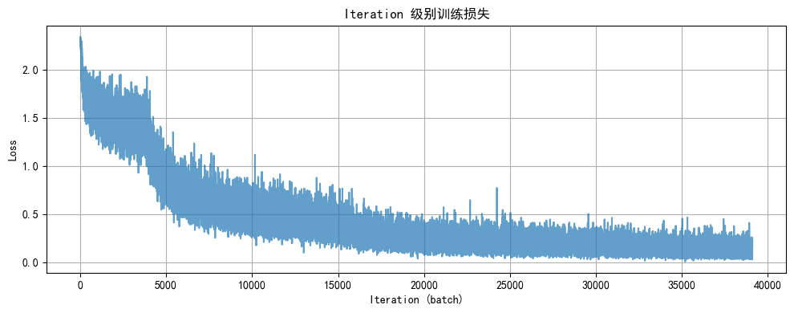
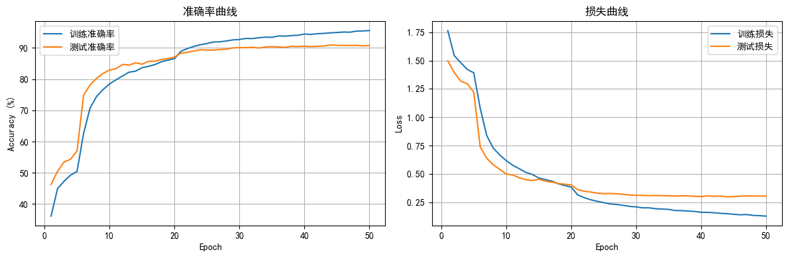

# Day 51｜在预训练 ResNet18 中注入 CBAM 注意力

结合昨天的基础实验，今天记录如何把 CBAM 注意力插入预训练 ResNet18 并用分阶段微调提升 CIFAR-10 分类效果。


今天要回答两个问题：
1. ResNet18 中如何插入 CBAM 模块而不破坏预训练权重？
2. 采用什么预训练/微调策略能更快提高效率？

核心原则：保留预训练特征提取器的价值，只在合适位置加注意力，并通过渐进解冻避免大幅扰动。


## 路线速览
- 复用 CIFAR-10 数据增强与归一化流程。
- 回顾 ResNet18 的层级结构、BasicBlock 与特征图尺寸演化。
- 讨论 CBAM 放置位置：末端 vs. 每个残差块后，并解释为什么后者可行。
- 编写 `ResNet18CBAM`，调整首层卷积/MaxPool 以适配 32x32 输入。
- 采用差异化学习率 + 三阶段解冻策略完成微调与可视化。


```python

import time
import torch
import torch.nn as nn
import torch.optim as optim
from torch.utils.data import DataLoader
from torchvision import datasets, transforms, models
import matplotlib.pyplot as plt
from torchinfo import summary
import numpy as np

# 基本设置
plt.rcParams['font.family'] = ['SimHei']
plt.rcParams['axes.unicode_minus'] = False  # 避免中文环境下负号显示成方块
torch.manual_seed(42)
if torch.cuda.is_available():
    torch.cuda.manual_seed_all(42)

device = torch.device('cuda' if torch.cuda.is_available() else 'cpu')
print(f'使用设备: {device}')

```

    使用设备: cuda


## 数据预处理与加载
CIFAR-10 只有 32x32 分辨率，使用轻量级增强即可：随机裁剪、翻转、颜色抖动、随机旋转，并配合标准归一化。


```python

# 数据增强与归一化
train_transform = transforms.Compose([
    transforms.RandomCrop(32, padding=4),
    transforms.RandomHorizontalFlip(),
    transforms.ColorJitter(brightness=0.2, contrast=0.2, saturation=0.2, hue=0.1),
    transforms.RandomRotation(15),
    transforms.ToTensor(),
    transforms.Normalize((0.4914, 0.4822, 0.4465), (0.2023, 0.1994, 0.2010)),
])

test_transform = transforms.Compose([
    transforms.ToTensor(),
    transforms.Normalize((0.4914, 0.4822, 0.4465), (0.2023, 0.1994, 0.2010)),
])

# 数据集与 DataLoader
train_dataset = datasets.CIFAR10(root='./data', train=True, download=True, transform=train_transform)
test_dataset = datasets.CIFAR10(root='./data', train=False, transform=test_transform)

train_loader = DataLoader(train_dataset, batch_size=64, shuffle=True, num_workers=2, pin_memory=True)
test_loader = DataLoader(test_dataset, batch_size=64, shuffle=False, num_workers=2, pin_memory=True)

print(f'训练集: {len(train_dataset)} 张, 测试集: {len(test_dataset)} 张')

```

    训练集: 50000 张, 测试集: 10000 张


## ResNet18 结构速览
经典 ResNet18 可以拆成三段：输入预处理 (stem)、四个残差 stage、分类头。

| 阶段 | 对应层级 | 主要作用 |
| :-- | :-- | :-- |
| 输入预处理 (Stem) | `conv1 → bn1 → relu → maxpool` | 将 224x224 图像下采样到 56x56，提取浅层纹理 |
| 核心特征提取 | `layer1` ~ `layer4` (每组 2 个 BasicBlock) | 逐步减半空间分辨率、通道数翻倍，累积语义 |
| 分类输出 (Head) | `avgpool → fc` | 全局平均池化后接线性层完成分类 |


### 特征图尺寸演化（输入 1x3x224x224）
| 位置 | 输出尺寸 | 变化说明 |
| :-- | :-- | :-- |
| conv1 (7x7, stride=2) | `[1, 64, 112, 112]` | 通道 3→64，尺寸减半 |
| maxpool (3x3, stride=2) | `[1, 64, 56, 56]` | 继续减半 |
| layer1 | `[1, 64, 56, 56]` | 2 个 BasicBlock，尺寸/通道不变 |
| layer2 | `[1, 128, 28, 28]` | 第一个块完成下采样与通道翻倍 |
| layer3 | `[1, 256, 14, 14]` | 同上 |
| layer4 | `[1, 512, 7, 7]` | 同上 |
| avgpool → fc | `[1, 1000]` | 池化为 1x1 后接全连接 |


### BasicBlock 残差思想
- 主路：`3x3 conv → BN → ReLU → 3x3 conv → BN` 学习残差 `F(x)`；
- 捷径：直接把输入 `x` 传到输出；
- 先求和再 ReLU：`H(x) = F(x) + x`，让网络学习“差值”而非完整映射，降低退化风险并提供梯度捷径。


```python

# 可选：查看 ResNet18 结构（使用随机初始化避免联网下载权重）
resnet18 = models.resnet18(weights=None)
resnet18.eval()
summary(resnet18, input_size=(1, 3, 224, 224))

```


    ==========================================================================================
    Layer (type:depth-idx)                   Output Shape              Param #
    ==========================================================================================
    ResNet                                   [1, 1000]                 --
    ├─Conv2d: 1-1                            [1, 64, 112, 112]         9,408
    ├─BatchNorm2d: 1-2                       [1, 64, 112, 112]         128
    ├─ReLU: 1-3                              [1, 64, 112, 112]         --
    ├─MaxPool2d: 1-4                         [1, 64, 56, 56]           --
    ├─Sequential: 1-5                        [1, 64, 56, 56]           --
    │    └─BasicBlock: 2-1                   [1, 64, 56, 56]           --
    │    │    └─Conv2d: 3-1                  [1, 64, 56, 56]           36,864
    │    │    └─BatchNorm2d: 3-2             [1, 64, 56, 56]           128
    │    │    └─ReLU: 3-3                    [1, 64, 56, 56]           --
    │    │    └─Conv2d: 3-4                  [1, 64, 56, 56]           36,864
    │    │    └─BatchNorm2d: 3-5             [1, 64, 56, 56]           128
    │    │    └─ReLU: 3-6                    [1, 64, 56, 56]           --
    │    └─BasicBlock: 2-2                   [1, 64, 56, 56]           --
    │    │    └─Conv2d: 3-7                  [1, 64, 56, 56]           36,864
    │    │    └─BatchNorm2d: 3-8             [1, 64, 56, 56]           128
    │    │    └─ReLU: 3-9                    [1, 64, 56, 56]           --
    │    │    └─Conv2d: 3-10                 [1, 64, 56, 56]           36,864
    │    │    └─BatchNorm2d: 3-11            [1, 64, 56, 56]           128
    │    │    └─ReLU: 3-12                   [1, 64, 56, 56]           --
    ├─Sequential: 1-6                        [1, 128, 28, 28]          --
    │    └─BasicBlock: 2-3                   [1, 128, 28, 28]          --
    │    │    └─Conv2d: 3-13                 [1, 128, 28, 28]          73,728
    │    │    └─BatchNorm2d: 3-14            [1, 128, 28, 28]          256
    │    │    └─ReLU: 3-15                   [1, 128, 28, 28]          --
    │    │    └─Conv2d: 3-16                 [1, 128, 28, 28]          147,456
    │    │    └─BatchNorm2d: 3-17            [1, 128, 28, 28]          256
    │    │    └─Sequential: 3-18             [1, 128, 28, 28]          8,448
    │    │    └─ReLU: 3-19                   [1, 128, 28, 28]          --
    │    └─BasicBlock: 2-4                   [1, 128, 28, 28]          --
    │    │    └─Conv2d: 3-20                 [1, 128, 28, 28]          147,456
    │    │    └─BatchNorm2d: 3-21            [1, 128, 28, 28]          256
    │    │    └─ReLU: 3-22                   [1, 128, 28, 28]          --
    │    │    └─Conv2d: 3-23                 [1, 128, 28, 28]          147,456
    │    │    └─BatchNorm2d: 3-24            [1, 128, 28, 28]          256
    │    │    └─ReLU: 3-25                   [1, 128, 28, 28]          --
    ├─Sequential: 1-7                        [1, 256, 14, 14]          --
    │    └─BasicBlock: 2-5                   [1, 256, 14, 14]          --
    │    │    └─Conv2d: 3-26                 [1, 256, 14, 14]          294,912
    │    │    └─BatchNorm2d: 3-27            [1, 256, 14, 14]          512
    │    │    └─ReLU: 3-28                   [1, 256, 14, 14]          --
    │    │    └─Conv2d: 3-29                 [1, 256, 14, 14]          589,824
    │    │    └─BatchNorm2d: 3-30            [1, 256, 14, 14]          512
    │    │    └─Sequential: 3-31             [1, 256, 14, 14]          33,280
    │    │    └─ReLU: 3-32                   [1, 256, 14, 14]          --
    │    └─BasicBlock: 2-6                   [1, 256, 14, 14]          --
    │    │    └─Conv2d: 3-33                 [1, 256, 14, 14]          589,824
    │    │    └─BatchNorm2d: 3-34            [1, 256, 14, 14]          512
    │    │    └─ReLU: 3-35                   [1, 256, 14, 14]          --
    │    │    └─Conv2d: 3-36                 [1, 256, 14, 14]          589,824
    │    │    └─BatchNorm2d: 3-37            [1, 256, 14, 14]          512
    │    │    └─ReLU: 3-38                   [1, 256, 14, 14]          --
    ├─Sequential: 1-8                        [1, 512, 7, 7]            --
    │    └─BasicBlock: 2-7                   [1, 512, 7, 7]            --
    │    │    └─Conv2d: 3-39                 [1, 512, 7, 7]            1,179,648
    │    │    └─BatchNorm2d: 3-40            [1, 512, 7, 7]            1,024
    │    │    └─ReLU: 3-41                   [1, 512, 7, 7]            --
    │    │    └─Conv2d: 3-42                 [1, 512, 7, 7]            2,359,296
    │    │    └─BatchNorm2d: 3-43            [1, 512, 7, 7]            1,024
    │    │    └─Sequential: 3-44             [1, 512, 7, 7]            132,096
    │    │    └─ReLU: 3-45                   [1, 512, 7, 7]            --
    │    └─BasicBlock: 2-8                   [1, 512, 7, 7]            --
    │    │    └─Conv2d: 3-46                 [1, 512, 7, 7]            2,359,296
    │    │    └─BatchNorm2d: 3-47            [1, 512, 7, 7]            1,024
    │    │    └─ReLU: 3-48                   [1, 512, 7, 7]            --
    │    │    └─Conv2d: 3-49                 [1, 512, 7, 7]            2,359,296
    │    │    └─BatchNorm2d: 3-50            [1, 512, 7, 7]            1,024
    │    │    └─ReLU: 3-51                   [1, 512, 7, 7]            --
    ├─AdaptiveAvgPool2d: 1-9                 [1, 512, 1, 1]            --
    ├─Linear: 1-10                           [1, 1000]                 513,000
    ==========================================================================================
    Total params: 11,689,512
    Trainable params: 11,689,512
    Non-trainable params: 0
    Total mult-adds (Units.GIGABYTES): 1.81
    ==========================================================================================
    Input size (MB): 0.60
    Forward/backward pass size (MB): 39.75
    Params size (MB): 46.76
    Estimated Total Size (MB): 87.11
    ==========================================================================================


## CBAM 放置位置的思考
1. 直接放在分类头前：实现最简单，但空间注意力在 1x1 特征上失效，只剩通道注意力。
2. 放在每个残差块后（推荐）：让注意力在中间层就参与特征重标定，同时不破坏预训练权重，因为 CBAM 初始化近似直通：
   - 随机初始化时注意力输出接近 0，`sigmoid(0)=0.5`，等价于把特征整体缩放一半，结构信息未被破坏；
   - 如果注意力无用，网络会把权重学到常数，近似 `x*1`；有用则自动聚焦重要通道与空间。


## CBAM 模块实现
通道注意力：全局平均池化 + 最大池化，共享 MLP 得到通道权重；
空间注意力：在通道维做均值/最大池化并拼接，经 7x7 卷积得到空间权重。


```python

class ChannelAttention(nn.Module):
    def __init__(self, in_channels, ratio=16):
        super().__init__()
        # 共享的两层全连接：降维后再升回去，学习通道间关系
        self.avg_pool = nn.AdaptiveAvgPool2d(1)
        self.max_pool = nn.AdaptiveMaxPool2d(1)
        self.fc = nn.Sequential(
            nn.Linear(in_channels, in_channels // ratio, bias=False),
            nn.ReLU(),
            nn.Linear(in_channels // ratio, in_channels, bias=False),
        )
        self.sigmoid = nn.Sigmoid()

    def forward(self, x):
        b, c, _, _ = x.shape
        avg_out = self.fc(self.avg_pool(x).view(b, c))
        max_out = self.fc(self.max_pool(x).view(b, c))
        attn = self.sigmoid(avg_out + max_out).view(b, c, 1, 1)
        return x * attn


class SpatialAttention(nn.Module):
    def __init__(self, kernel_size=7):
        super().__init__()
        self.conv = nn.Conv2d(2, 1, kernel_size, padding=kernel_size // 2, bias=False)
        self.sigmoid = nn.Sigmoid()

    def forward(self, x):
        avg_out = torch.mean(x, dim=1, keepdim=True)
        max_out, _ = torch.max(x, dim=1, keepdim=True)
        pooled = torch.cat([avg_out, max_out], dim=1)
        attn = self.sigmoid(self.conv(pooled))
        return x * attn


class CBAM(nn.Module):
    def __init__(self, in_channels, ratio=16, kernel_size=7):
        super().__init__()
        self.channel_attn = ChannelAttention(in_channels, ratio)
        self.spatial_attn = SpatialAttention(kernel_size)

    def forward(self, x):
        x = self.channel_attn(x)
        x = self.spatial_attn(x)
        return x

```


## 将 CBAM 注入 ResNet18
- 使用 `weights=ResNet18_Weights.DEFAULT` 加载预训练权重（若无法联网，将自动降级为随机初始化）。
- 首层卷积改为 3x3, stride=1，移除 MaxPool 以适配 32x32。
- 在 `layer1~4` 输出后各加一个 CBAM 模块。
- 分类头输出改为 10 类。


```python

class ResNet18CBAM(nn.Module):
    def __init__(self, num_classes=10, pretrained=True, cbam_ratio=16, cbam_kernel=7):
        super().__init__()
        weights = models.ResNet18_Weights.DEFAULT if pretrained else None
        try:
            self.backbone = models.resnet18(weights=weights)
        except Exception as e:
            print(f'预训练权重加载失败，改用随机初始化: {e}')
            self.backbone = models.resnet18(weights=None)

        # 调整首层以适应 32x32 输入；原始设定针对 224x224
        self.backbone.conv1 = nn.Conv2d(3, 64, kernel_size=3, stride=1, padding=1, bias=False)
        self.backbone.maxpool = nn.Identity()  # 小分辨率下不再需要初始池化

        # 在四个 stage 后各插入一个 CBAM
        self.cbam1 = CBAM(64, ratio=cbam_ratio, kernel_size=cbam_kernel)
        self.cbam2 = CBAM(128, ratio=cbam_ratio, kernel_size=cbam_kernel)
        self.cbam3 = CBAM(256, ratio=cbam_ratio, kernel_size=cbam_kernel)
        self.cbam4 = CBAM(512, ratio=cbam_ratio, kernel_size=cbam_kernel)

        # 分类头输出 10 类
        self.backbone.fc = nn.Linear(512, num_classes)

    def forward(self, x):
        # stem
        x = self.backbone.conv1(x)
        x = self.backbone.bn1(x)
        x = self.backbone.relu(x)  # [B, 64, 32, 32]

        # layer1 + CBAM
        x = self.backbone.layer1(x)  # [B, 64, 32, 32]
        x = self.cbam1(x)

        # layer2 + CBAM
        x = self.backbone.layer2(x)  # [B, 128, 16, 16]
        x = self.cbam2(x)

        # layer3 + CBAM
        x = self.backbone.layer3(x)  # [B, 256, 8, 8]
        x = self.cbam3(x)

        # layer4 + CBAM
        x = self.backbone.layer4(x)  # [B, 512, 4, 4]
        x = self.cbam4(x)

        # 分类头
        x = self.backbone.avgpool(x)  # [B, 512, 1, 1]
        x = torch.flatten(x, 1)
        x = self.backbone.fc(x)
        return x

```


## 训练策略：差异化学习率 + 三阶段解冻
把预训练卷积分成“资深专家”，新加的 CBAM 与分类头当作“实习生”。
- 专家：需要小步微调，学习率设得很低。
- 实习生：从零学习，学习率可大一些。
三阶段策略（可根据算力调小 epoch 先试跑）：

| 阶段 | epoch 范围 | 解冻层 | 学习率 | 目的 |
| :-- | :-- | :-- | :-- | :-- |
| 1 | 1-5 | 仅 CBAM + `fc` | 1e-3 | 先让新模块找到关注点，确定分类边界 |
| 2 | 6-20 | CBAM + `fc` + `layer3`、`layer4` | 1e-4 | 解冻高层语义特征，适应任务 |
| 3 | 21-50 | 全部层 | 1e-5 | 全局微调，微小步长避免遗忘 |


```python

def set_trainable_layers(model, trainable_parts):
    # 先冻结全部参数，再按名字关键字解冻指定模块
    for name, param in model.named_parameters():
        param.requires_grad = False
        if any(part in name for part in trainable_parts):
            param.requires_grad = True


def train_staged_finetuning(model, criterion, train_loader, test_loader, device, epochs=50):
    history = {
        'iter_indices': [],
        'iter_losses': [],
        'train_acc': [],
        'test_acc': [],
        'train_loss': [],
        'test_loss': [],
    }
    optimizer = None

    for epoch in range(1, epochs + 1):
        # 动态切换解冻范围与学习率
        if epoch == 1:
            set_trainable_layers(model, ['cbam', 'backbone.fc'])
            optimizer = optim.Adam(filter(lambda p: p.requires_grad, model.parameters()), lr=1e-3)
        elif epoch == 6:
            set_trainable_layers(model, ['cbam', 'backbone.fc', 'backbone.layer3', 'backbone.layer4'])
            optimizer = optim.Adam(filter(lambda p: p.requires_grad, model.parameters()), lr=1e-4)
        elif epoch == 21:
            for param in model.parameters():
                param.requires_grad = True
            optimizer = optim.Adam(model.parameters(), lr=1e-5)

        # 训练阶段
        model.train()
        running_loss, correct, total = 0.0, 0, 0
        for batch_idx, (data, target) in enumerate(train_loader, start=1):
            data, target = data.to(device), target.to(device)
            optimizer.zero_grad()
            output = model(data)
            loss = criterion(output, target)
            loss.backward()
            optimizer.step()

            running_loss += loss.item()
            _, pred = output.max(1)
            total += target.size(0)
            correct += pred.eq(target).sum().item()

            history['iter_indices'].append((epoch - 1) * len(train_loader) + batch_idx)
            history['iter_losses'].append(loss.item())

            if batch_idx % 100 == 0:
                avg_loss = running_loss / batch_idx
                print(f'Epoch {epoch:02d}/{epochs} | Batch {batch_idx:03d}/{len(train_loader)} | 单batch损失 {loss.item():.4f} | 均值损失 {avg_loss:.4f}')

        epoch_train_loss = running_loss / len(train_loader)
        epoch_train_acc = 100.0 * correct / total
        history['train_loss'].append(epoch_train_loss)
        history['train_acc'].append(epoch_train_acc)

        # 验证阶段
        model.eval()
        test_loss, correct_test, total_test = 0.0, 0, 0
        with torch.no_grad():
            for data, target in test_loader:
                data, target = data.to(device), target.to(device)
                output = model(data)
                test_loss += criterion(output, target).item()
                _, pred = output.max(1)
                total_test += target.size(0)
                correct_test += pred.eq(target).sum().item()

        epoch_test_loss = test_loss / len(test_loader)
        epoch_test_acc = 100.0 * correct_test / total_test
        history['test_loss'].append(epoch_test_loss)
        history['test_acc'].append(epoch_test_acc)

        print(f'Epoch {epoch:02d}/{epochs} | 训练Acc {epoch_train_acc:.2f}% | 测试Acc {epoch_test_acc:.2f}%')

    return history


def plot_iter_losses(history):
    plt.figure(figsize=(10, 4))
    plt.plot(history['iter_indices'], history['iter_losses'], alpha=0.7)
    plt.xlabel('Iteration (batch)')
    plt.ylabel('Loss')
    plt.title('Iteration 级别训练损失')
    plt.grid(True)
    plt.tight_layout()
    plt.show()


def plot_epoch_metrics(history):
    epochs = range(1, len(history['train_acc']) + 1)

    plt.figure(figsize=(12, 4))
    plt.subplot(1, 2, 1)
    plt.plot(epochs, history['train_acc'], label='训练准确率')
    plt.plot(epochs, history['test_acc'], label='测试准确率')
    plt.xlabel('Epoch')
    plt.ylabel('Accuracy (%)')
    plt.title('准确率曲线')
    plt.legend(); plt.grid(True)

    plt.subplot(1, 2, 2)
    plt.plot(epochs, history['train_loss'], label='训练损失')
    plt.plot(epochs, history['test_loss'], label='测试损失')
    plt.xlabel('Epoch')
    plt.ylabel('Loss')
    plt.title('损失曲线')
    plt.legend(); plt.grid(True)
    plt.tight_layout()
    plt.show()

```


## 开始训练
默认跑 50 个 epoch；算力有限时可先跑 5~10 轮确认流程，再拉满。


```python

epochs = 50  # 可根据算力调整
model = ResNet18CBAM(pretrained=True).to(device)
criterion = nn.CrossEntropyLoss()

print('开始分阶段微调...')
history = train_staged_finetuning(model, criterion, train_loader, test_loader, device, epochs=epochs)

plot_iter_losses(history)
plot_epoch_metrics(history)

torch.save(model.state_dict(), 'resnet18_cbam_finetuned.pth')
print('模型已保存到 resnet18_cbam_finetuned.pth')

```

    开始分阶段微调...
    Epoch 01/50 | Batch 100/782 | 单batch损失 2.2254 | 均值损失 2.1764
    Epoch 01/50 | Batch 200/782 | 单batch损失 1.8532 | 均值损失 2.0260
    Epoch 01/50 | Batch 300/782 | 单batch损失 1.4626 | 均值损失 1.9374
    Epoch 01/50 | Batch 400/782 | 单batch损失 1.6439 | 均值损失 1.8802
    Epoch 01/50 | Batch 500/782 | 单batch损失 1.5029 | 均值损失 1.8403
    Epoch 01/50 | Batch 600/782 | 单batch损失 1.7956 | 均值损失 1.8095
    Epoch 01/50 | Batch 700/782 | 单batch损失 1.8239 | 均值损失 1.7830
    Epoch 01/50 | 训练Acc 36.14% | 测试Acc 46.28%
    Epoch 02/50 | Batch 100/782 | 单batch损失 1.6897 | 均值损失 1.5919
    Epoch 02/50 | Batch 200/782 | 单batch损失 1.4652 | 均值损失 1.5834
    Epoch 02/50 | Batch 300/782 | 单batch损失 1.6862 | 均值损失 1.5734
    Epoch 02/50 | Batch 400/782 | 单batch损失 1.3500 | 均值损失 1.5697
    Epoch 02/50 | Batch 500/782 | 单batch损失 1.5694 | 均值损失 1.5621
    Epoch 02/50 | Batch 600/782 | 单batch损失 1.5129 | 均值损失 1.5561
    Epoch 02/50 | Batch 700/782 | 单batch损失 1.2951 | 均值损失 1.5493
    Epoch 02/50 | 训练Acc 44.97% | 测试Acc 50.53%
    Epoch 03/50 | Batch 100/782 | 单batch损失 1.3975 | 均值损失 1.5060
    Epoch 03/50 | Batch 200/782 | 单batch损失 1.7366 | 均值损失 1.4945
    Epoch 03/50 | Batch 300/782 | 单batch损失 1.5163 | 均值损失 1.4993
    Epoch 03/50 | Batch 400/782 | 单batch损失 1.6144 | 均值损失 1.4931
    Epoch 03/50 | Batch 500/782 | 单batch损失 1.4052 | 均值损失 1.4881
    Epoch 03/50 | Batch 600/782 | 单batch损失 1.2379 | 均值损失 1.4871
    Epoch 03/50 | Batch 700/782 | 单batch损失 1.4502 | 均值损失 1.4839
    Epoch 03/50 | 训练Acc 47.29% | 测试Acc 53.47%
    Epoch 04/50 | Batch 100/782 | 单batch损失 1.3503 | 均值损失 1.4387
    Epoch 04/50 | Batch 200/782 | 单batch损失 1.3691 | 均值损失 1.4293
    Epoch 04/50 | Batch 300/782 | 单batch损失 1.4282 | 均值损失 1.4384
    Epoch 04/50 | Batch 400/782 | 单batch损失 1.3360 | 均值损失 1.4337
    Epoch 04/50 | Batch 500/782 | 单batch损失 1.5842 | 均值损失 1.4342
    Epoch 04/50 | Batch 600/782 | 单batch损失 1.5821 | 均值损失 1.4308
    Epoch 04/50 | Batch 700/782 | 单batch损失 1.1338 | 均值损失 1.4267
    Epoch 04/50 | 训练Acc 49.26% | 测试Acc 54.35%
    Epoch 05/50 | Batch 100/782 | 单batch损失 1.3227 | 均值损失 1.3999
    Epoch 05/50 | Batch 200/782 | 单batch损失 1.1665 | 均值损失 1.3996
    Epoch 05/50 | Batch 300/782 | 单batch损失 1.5437 | 均值损失 1.3920
    Epoch 05/50 | Batch 400/782 | 单batch损失 1.1823 | 均值损失 1.3959
    Epoch 05/50 | Batch 500/782 | 单batch损失 1.4283 | 均值损失 1.3934
    Epoch 05/50 | Batch 600/782 | 单batch损失 1.4250 | 均值损失 1.3951
    Epoch 05/50 | Batch 700/782 | 单batch损失 1.4635 | 均值损失 1.3950
    Epoch 05/50 | 训练Acc 50.44% | 测试Acc 57.04%
    Epoch 06/50 | Batch 100/782 | 单batch损失 1.4364 | 均值损失 1.3082
    Epoch 06/50 | Batch 200/782 | 单batch损失 1.0548 | 均值损失 1.2453
    Epoch 06/50 | Batch 300/782 | 单batch损失 0.9012 | 均值损失 1.2074
    Epoch 06/50 | Batch 400/782 | 单batch损失 0.9596 | 均值损失 1.1733
    Epoch 06/50 | Batch 500/782 | 单batch损失 1.0340 | 均值损失 1.1392
    Epoch 06/50 | Batch 600/782 | 单batch损失 0.8669 | 均值损失 1.1127
    Epoch 06/50 | Batch 700/782 | 单batch损失 0.9746 | 均值损失 1.0926
    Epoch 06/50 | 训练Acc 62.58% | 测试Acc 74.76%
    Epoch 07/50 | Batch 100/782 | 单batch损失 0.9268 | 均值损失 0.8842
    Epoch 07/50 | Batch 200/782 | 单batch损失 1.0391 | 均值损失 0.8753
    Epoch 07/50 | Batch 300/782 | 单batch损失 1.0002 | 均值损失 0.8700
    Epoch 07/50 | Batch 400/782 | 单batch损失 0.9867 | 均值损失 0.8580
    Epoch 07/50 | Batch 500/782 | 单batch损失 0.7908 | 均值损失 0.8508
    Epoch 07/50 | Batch 600/782 | 单batch损失 0.6506 | 均值损失 0.8490
    Epoch 07/50 | Batch 700/782 | 单batch损失 0.8783 | 均值损失 0.8428
    Epoch 07/50 | 训练Acc 70.73% | 测试Acc 78.16%
    Epoch 08/50 | Batch 100/782 | 单batch损失 0.9773 | 均值损失 0.7480
    Epoch 08/50 | Batch 200/782 | 单batch损失 0.6106 | 均值损失 0.7388
    Epoch 08/50 | Batch 300/782 | 单batch损失 0.9895 | 均值损失 0.7344
    Epoch 08/50 | Batch 400/782 | 单batch损失 0.7317 | 均值损失 0.7311
    Epoch 08/50 | Batch 500/782 | 单batch损失 0.8980 | 均值损失 0.7316
    Epoch 08/50 | Batch 600/782 | 单batch损失 0.9562 | 均值损失 0.7320
    Epoch 08/50 | Batch 700/782 | 单batch损失 0.7297 | 均值损失 0.7297
    Epoch 08/50 | 训练Acc 74.44% | 测试Acc 80.27%
    Epoch 09/50 | Batch 100/782 | 单batch损失 0.9402 | 均值损失 0.6678
    Epoch 09/50 | Batch 200/782 | 单batch损失 0.6840 | 均值损失 0.6676
    Epoch 09/50 | Batch 300/782 | 单batch损失 0.4784 | 均值损失 0.6669
    Epoch 09/50 | Batch 400/782 | 单batch损失 0.7738 | 均值损失 0.6709
    Epoch 09/50 | Batch 500/782 | 单batch损失 0.5379 | 均值损失 0.6676
    Epoch 09/50 | Batch 600/782 | 单batch损失 0.5289 | 均值损失 0.6678
    Epoch 09/50 | Batch 700/782 | 单batch损失 0.7943 | 均值损失 0.6663
    Epoch 09/50 | 训练Acc 76.66% | 测试Acc 81.81%
    Epoch 10/50 | Batch 100/782 | 单batch损失 0.7901 | 均值损失 0.6105
    Epoch 10/50 | Batch 200/782 | 单batch损失 0.7190 | 均值损失 0.6165
    Epoch 10/50 | Batch 300/782 | 单batch损失 0.6226 | 均值损失 0.6209
    Epoch 10/50 | Batch 400/782 | 单batch损失 0.7097 | 均值损失 0.6206
    Epoch 10/50 | Batch 500/782 | 单batch损失 0.6374 | 均值损失 0.6216
    Epoch 10/50 | Batch 600/782 | 单batch损失 0.6944 | 均值损失 0.6217
    Epoch 10/50 | Batch 700/782 | 单batch损失 0.6380 | 均值损失 0.6175
    Epoch 10/50 | 训练Acc 78.47% | 测试Acc 82.90%
    Epoch 11/50 | Batch 100/782 | 单batch损失 0.5797 | 均值损失 0.5771
    Epoch 11/50 | Batch 200/782 | 单batch损失 0.4435 | 均值损失 0.5807
    Epoch 11/50 | Batch 300/782 | 单batch损失 0.5036 | 均值损失 0.5824
    Epoch 11/50 | Batch 400/782 | 单batch损失 0.7123 | 均值损失 0.5847
    Epoch 11/50 | Batch 500/782 | 单batch损失 0.5023 | 均值损失 0.5811
    Epoch 11/50 | Batch 600/782 | 单batch损失 0.3309 | 均值损失 0.5782
    Epoch 11/50 | Batch 700/782 | 单batch损失 0.4415 | 均值损失 0.5778
    Epoch 11/50 | 训练Acc 79.77% | 测试Acc 83.35%
    Epoch 12/50 | Batch 100/782 | 单batch损失 0.7674 | 均值损失 0.5502
    Epoch 12/50 | Batch 200/782 | 单batch损失 0.3793 | 均值损失 0.5469
    Epoch 12/50 | Batch 300/782 | 单batch损失 0.3830 | 均值损失 0.5469
    Epoch 12/50 | Batch 400/782 | 单batch损失 0.7544 | 均值损失 0.5460
    Epoch 12/50 | Batch 500/782 | 单batch损失 0.7096 | 均值损失 0.5452
    Epoch 12/50 | Batch 600/782 | 单batch损失 0.4608 | 均值损失 0.5438
    Epoch 12/50 | Batch 700/782 | 单batch损失 0.6081 | 均值损失 0.5469
    Epoch 12/50 | 训练Acc 81.02% | 测试Acc 84.70%
    Epoch 13/50 | Batch 100/782 | 单batch损失 0.5452 | 均值损失 0.5137
    Epoch 13/50 | Batch 200/782 | 单batch损失 0.3571 | 均值损失 0.5144
    Epoch 13/50 | Batch 300/782 | 单batch损失 0.5766 | 均值损失 0.5134
    Epoch 13/50 | Batch 400/782 | 单batch损失 0.4029 | 均值损失 0.5150
    Epoch 13/50 | Batch 500/782 | 单batch损失 0.4804 | 均值损失 0.5135
    Epoch 13/50 | Batch 600/782 | 单batch损失 0.5302 | 均值损失 0.5142
    Epoch 13/50 | Batch 700/782 | 单batch损失 0.5666 | 均值损失 0.5146
    Epoch 13/50 | 训练Acc 82.22% | 测试Acc 84.47%
    Epoch 14/50 | Batch 100/782 | 单batch损失 0.4938 | 均值损失 0.4725
    Epoch 14/50 | Batch 200/782 | 单batch损失 0.4356 | 均值损失 0.4917
    Epoch 14/50 | Batch 300/782 | 单batch损失 0.5272 | 均值损失 0.4907
    Epoch 14/50 | Batch 400/782 | 单batch损失 0.9394 | 均值损失 0.4888
    Epoch 14/50 | Batch 500/782 | 单batch损失 0.4969 | 均值损失 0.4910
    Epoch 14/50 | Batch 600/782 | 单batch损失 0.4989 | 均值损失 0.4950
    Epoch 14/50 | Batch 700/782 | 单batch损失 0.5726 | 均值损失 0.4950
    Epoch 14/50 | 训练Acc 82.55% | 测试Acc 85.22%
    Epoch 15/50 | Batch 100/782 | 单batch损失 0.6294 | 均值损失 0.4615
    Epoch 15/50 | Batch 200/782 | 单batch损失 0.3719 | 均值损失 0.4666
    Epoch 15/50 | Batch 300/782 | 单batch损失 0.6710 | 均值损失 0.4678
    Epoch 15/50 | Batch 400/782 | 单batch损失 0.6296 | 均值损失 0.4602
    Epoch 15/50 | Batch 500/782 | 单batch损失 0.4554 | 均值损失 0.4603
    Epoch 15/50 | Batch 600/782 | 单batch损失 0.4512 | 均值损失 0.4621
    Epoch 15/50 | Batch 700/782 | 单batch损失 0.5595 | 均值损失 0.4652
    Epoch 15/50 | 训练Acc 83.65% | 测试Acc 84.79%
    Epoch 16/50 | Batch 100/782 | 单batch损失 0.5154 | 均值损失 0.4504
    Epoch 16/50 | Batch 200/782 | 单batch损失 0.5989 | 均值损失 0.4542
    Epoch 16/50 | Batch 300/782 | 单batch损失 0.6018 | 均值损失 0.4451
    Epoch 16/50 | Batch 400/782 | 单batch损失 0.3854 | 均值损失 0.4494
    Epoch 16/50 | Batch 500/782 | 单batch损失 0.5229 | 均值损失 0.4527
    Epoch 16/50 | Batch 600/782 | 单batch损失 0.3156 | 均值损失 0.4495
    Epoch 16/50 | Batch 700/782 | 单batch损失 0.4236 | 均值损失 0.4482
    Epoch 16/50 | 训练Acc 84.11% | 测试Acc 85.68%
    Epoch 17/50 | Batch 100/782 | 单batch损失 0.2710 | 均值损失 0.4394
    Epoch 17/50 | Batch 200/782 | 单batch损失 0.4344 | 均值损失 0.4454
    Epoch 17/50 | Batch 300/782 | 单batch损失 0.7163 | 均值损失 0.4425
    Epoch 17/50 | Batch 400/782 | 单batch损失 0.3753 | 均值损失 0.4319
    Epoch 17/50 | Batch 500/782 | 单batch损失 0.3306 | 均值损失 0.4298
    Epoch 17/50 | Batch 600/782 | 单batch损失 0.4180 | 均值损失 0.4352
    Epoch 17/50 | Batch 700/782 | 单batch损失 0.5342 | 均值损失 0.4358
    Epoch 17/50 | 训练Acc 84.66% | 测试Acc 85.74%
    Epoch 18/50 | Batch 100/782 | 单batch损失 0.4098 | 均值损失 0.3996
    Epoch 18/50 | Batch 200/782 | 单batch损失 0.6079 | 均值损失 0.4116
    Epoch 18/50 | Batch 300/782 | 单batch损失 0.3363 | 均值损失 0.4110
    Epoch 18/50 | Batch 400/782 | 单batch损失 0.5377 | 均值损失 0.4118
    Epoch 18/50 | Batch 500/782 | 单batch损失 0.3914 | 均值损失 0.4118
    Epoch 18/50 | Batch 600/782 | 单batch损失 0.3488 | 均值损失 0.4135
    Epoch 18/50 | Batch 700/782 | 单batch损失 0.5333 | 均值损失 0.4126
    Epoch 18/50 | 训练Acc 85.57% | 测试Acc 86.28%
    Epoch 19/50 | Batch 100/782 | 单batch损失 0.5213 | 均值损失 0.3874
    Epoch 19/50 | Batch 200/782 | 单batch损失 0.4482 | 均值损失 0.3811
    Epoch 19/50 | Batch 300/782 | 单batch损失 0.3418 | 均值损失 0.3927
    Epoch 19/50 | Batch 400/782 | 单batch损失 0.5550 | 均值损失 0.3932
    Epoch 19/50 | Batch 500/782 | 单batch损失 0.4002 | 均值损失 0.3931
    Epoch 19/50 | Batch 600/782 | 单batch损失 0.1668 | 均值损失 0.3948
    Epoch 19/50 | Batch 700/782 | 单batch损失 0.3132 | 均值损失 0.3958
    Epoch 19/50 | 训练Acc 86.07% | 测试Acc 86.55%
    Epoch 20/50 | Batch 100/782 | 单batch损失 0.3056 | 均值损失 0.3750
    Epoch 20/50 | Batch 200/782 | 单batch损失 0.3729 | 均值损失 0.3779
    Epoch 20/50 | Batch 300/782 | 单batch损失 0.4185 | 均值损失 0.3846
    Epoch 20/50 | Batch 400/782 | 单batch损失 0.3447 | 均值损失 0.3808
    Epoch 20/50 | Batch 500/782 | 单batch损失 0.5656 | 均值损失 0.3819
    Epoch 20/50 | Batch 600/782 | 单batch损失 0.5232 | 均值损失 0.3808
    Epoch 20/50 | Batch 700/782 | 单batch损失 0.3953 | 均值损失 0.3812
    Epoch 20/50 | 训练Acc 86.57% | 测试Acc 87.09%
    Epoch 21/50 | Batch 100/782 | 单batch损失 0.3272 | 均值损失 0.3366
    Epoch 21/50 | Batch 200/782 | 单batch损失 0.3611 | 均值损失 0.3349
    Epoch 21/50 | Batch 300/782 | 单batch损失 0.3837 | 均值损失 0.3309
    Epoch 21/50 | Batch 400/782 | 单batch损失 0.2133 | 均值损失 0.3247
    Epoch 21/50 | Batch 500/782 | 单batch损失 0.3148 | 均值损失 0.3206
    Epoch 21/50 | Batch 600/782 | 单batch损失 0.3947 | 均值损失 0.3188
    Epoch 21/50 | Batch 700/782 | 单batch损失 0.2580 | 均值损失 0.3159
    Epoch 21/50 | 训练Acc 88.94% | 测试Acc 88.33%
    Epoch 22/50 | Batch 100/782 | 单batch损失 0.1564 | 均值损失 0.3060
    Epoch 22/50 | Batch 200/782 | 单batch损失 0.1848 | 均值损失 0.3008
    Epoch 22/50 | Batch 300/782 | 单batch损失 0.2677 | 均值损失 0.3000
    Epoch 22/50 | Batch 400/782 | 单batch损失 0.4259 | 均值损失 0.2962
    Epoch 22/50 | Batch 500/782 | 单batch损失 0.1688 | 均值损失 0.2912
    Epoch 22/50 | Batch 600/782 | 单batch损失 0.3426 | 均值损失 0.2937
    Epoch 22/50 | Batch 700/782 | 单batch损失 0.2231 | 均值损失 0.2902
    Epoch 22/50 | 训练Acc 89.79% | 测试Acc 88.59%
    Epoch 23/50 | Batch 100/782 | 单batch损失 0.2680 | 均值损失 0.2559
    Epoch 23/50 | Batch 200/782 | 单batch损失 0.2596 | 均值损失 0.2685
    Epoch 23/50 | Batch 300/782 | 单batch损失 0.2812 | 均值损失 0.2728
    Epoch 23/50 | Batch 400/782 | 单batch损失 0.2676 | 均值损失 0.2749
    Epoch 23/50 | Batch 500/782 | 单batch损失 0.3540 | 均值损失 0.2710
    Epoch 23/50 | Batch 600/782 | 单batch损失 0.4398 | 均值损失 0.2703
    Epoch 23/50 | Batch 700/782 | 单batch损失 0.3269 | 均值损失 0.2699
    Epoch 23/50 | 训练Acc 90.50% | 测试Acc 89.00%
    Epoch 24/50 | Batch 100/782 | 单batch损失 0.2278 | 均值损失 0.2751
    Epoch 24/50 | Batch 200/782 | 单batch损失 0.1640 | 均值损失 0.2672
    Epoch 24/50 | Batch 300/782 | 单batch损失 0.2136 | 均值损失 0.2638
    Epoch 24/50 | Batch 400/782 | 单batch损失 0.4057 | 均值损失 0.2630
    Epoch 24/50 | Batch 500/782 | 单batch损失 0.2461 | 均值损失 0.2611
    Epoch 24/50 | Batch 600/782 | 单batch损失 0.4040 | 均值损失 0.2584
    Epoch 24/50 | Batch 700/782 | 单batch损失 0.3192 | 均值损失 0.2585
    Epoch 24/50 | 训练Acc 91.00% | 测试Acc 89.39%
    Epoch 25/50 | Batch 100/782 | 单batch损失 0.1836 | 均值损失 0.2473
    Epoch 25/50 | Batch 200/782 | 单batch损失 0.2514 | 均值损失 0.2508
    Epoch 25/50 | Batch 300/782 | 单batch损失 0.2458 | 均值损失 0.2505
    Epoch 25/50 | Batch 400/782 | 单batch损失 0.1189 | 均值损失 0.2474
    Epoch 25/50 | Batch 500/782 | 单batch损失 0.1812 | 均值损失 0.2484
    Epoch 25/50 | Batch 600/782 | 单batch损失 0.3643 | 均值损失 0.2462
    Epoch 25/50 | Batch 700/782 | 单batch损失 0.3079 | 均值损失 0.2465
    Epoch 25/50 | 训练Acc 91.39% | 测试Acc 89.28%
    Epoch 26/50 | Batch 100/782 | 单batch损失 0.1193 | 均值损失 0.2308
    Epoch 26/50 | Batch 200/782 | 单batch损失 0.1846 | 均值损失 0.2327
    Epoch 26/50 | Batch 300/782 | 单batch损失 0.1715 | 均值损失 0.2355
    Epoch 26/50 | Batch 400/782 | 单batch损失 0.3592 | 均值损失 0.2383
    Epoch 26/50 | Batch 500/782 | 单batch损失 0.2365 | 均值损失 0.2364
    Epoch 26/50 | Batch 600/782 | 单batch损失 0.2309 | 均值损失 0.2353
    Epoch 26/50 | Batch 700/782 | 单batch损失 0.3581 | 均值损失 0.2343
    Epoch 26/50 | 训练Acc 91.88% | 测试Acc 89.30%
    Epoch 27/50 | Batch 100/782 | 单batch损失 0.1433 | 均值损失 0.2317
    Epoch 27/50 | Batch 200/782 | 单batch损失 0.2297 | 均值损失 0.2288
    Epoch 27/50 | Batch 300/782 | 单batch损失 0.2328 | 均值损失 0.2264
    Epoch 27/50 | Batch 400/782 | 单batch损失 0.1913 | 均值损失 0.2266
    Epoch 27/50 | Batch 500/782 | 单batch损失 0.1723 | 均值损失 0.2272
    Epoch 27/50 | Batch 600/782 | 单batch损失 0.3864 | 均值损失 0.2289
    Epoch 27/50 | Batch 700/782 | 单batch损失 0.2121 | 均值损失 0.2291
    Epoch 27/50 | 训练Acc 91.94% | 测试Acc 89.49%
    Epoch 28/50 | Batch 100/782 | 单batch损失 0.2493 | 均值损失 0.2180
    Epoch 28/50 | Batch 200/782 | 单batch损失 0.1884 | 均值损失 0.2164
    Epoch 28/50 | Batch 300/782 | 单batch损失 0.1680 | 均值损失 0.2203
    Epoch 28/50 | Batch 400/782 | 单batch损失 0.2320 | 均值损失 0.2216
    Epoch 28/50 | Batch 500/782 | 单batch损失 0.2297 | 均值损失 0.2223
    Epoch 28/50 | Batch 600/782 | 单batch损失 0.1857 | 均值损失 0.2226
    Epoch 28/50 | Batch 700/782 | 单batch损失 0.2686 | 均值损失 0.2221
    Epoch 28/50 | 训练Acc 92.22% | 测试Acc 89.59%
    Epoch 29/50 | Batch 100/782 | 单batch损失 0.1583 | 均值损失 0.2100
    Epoch 29/50 | Batch 200/782 | 单batch损失 0.2553 | 均值损失 0.2098
    Epoch 29/50 | Batch 300/782 | 单batch损失 0.2109 | 均值损失 0.2106
    Epoch 29/50 | Batch 400/782 | 单batch损失 0.1185 | 均值损失 0.2114
    Epoch 29/50 | Batch 500/782 | 单batch损失 0.1454 | 均值损失 0.2125
    Epoch 29/50 | Batch 600/782 | 单batch损失 0.2670 | 均值损失 0.2126
    Epoch 29/50 | Batch 700/782 | 单batch损失 0.1977 | 均值损失 0.2131
    Epoch 29/50 | 训练Acc 92.56% | 测试Acc 90.00%
    Epoch 30/50 | Batch 100/782 | 单batch损失 0.1439 | 均值损失 0.2037
    Epoch 30/50 | Batch 200/782 | 单batch损失 0.1784 | 均值损失 0.2127
    Epoch 30/50 | Batch 300/782 | 单batch损失 0.1672 | 均值损失 0.2115
    Epoch 30/50 | Batch 400/782 | 单batch损失 0.2422 | 均值损失 0.2084
    Epoch 30/50 | Batch 500/782 | 单batch损失 0.2483 | 均值损失 0.2084
    Epoch 30/50 | Batch 600/782 | 单batch损失 0.1341 | 均值损失 0.2084
    Epoch 30/50 | Batch 700/782 | 单batch损失 0.1625 | 均值损失 0.2078
    Epoch 30/50 | 训练Acc 92.67% | 测试Acc 90.08%
    Epoch 31/50 | Batch 100/782 | 单batch损失 0.2577 | 均值损失 0.1958
    Epoch 31/50 | Batch 200/782 | 单batch损失 0.1945 | 均值损失 0.1985
    Epoch 31/50 | Batch 300/782 | 单batch损失 0.2463 | 均值损失 0.1990
    Epoch 31/50 | Batch 400/782 | 单batch损失 0.1671 | 均值损失 0.1993
    Epoch 31/50 | Batch 500/782 | 单batch损失 0.1270 | 均值损失 0.1977
    Epoch 31/50 | Batch 600/782 | 单batch损失 0.0995 | 均值损失 0.1993
    Epoch 31/50 | Batch 700/782 | 单batch损失 0.1642 | 均值损失 0.1997
    Epoch 31/50 | 训练Acc 93.03% | 测试Acc 90.07%
    Epoch 32/50 | Batch 100/782 | 单batch损失 0.2713 | 均值损失 0.1881
    Epoch 32/50 | Batch 200/782 | 单batch损失 0.2445 | 均值损失 0.1949
    Epoch 32/50 | Batch 300/782 | 单batch损失 0.2481 | 均值损失 0.1970
    Epoch 32/50 | Batch 400/782 | 单batch损失 0.2441 | 均值损失 0.2002
    Epoch 32/50 | Batch 500/782 | 单batch损失 0.2528 | 均值损失 0.2004
    Epoch 32/50 | Batch 600/782 | 单batch损失 0.1789 | 均值损失 0.1998
    Epoch 32/50 | Batch 700/782 | 单batch损失 0.1489 | 均值损失 0.1999
    Epoch 32/50 | 训练Acc 92.98% | 测试Acc 90.18%
    Epoch 33/50 | Batch 100/782 | 单batch损失 0.1915 | 均值损失 0.1933
    Epoch 33/50 | Batch 200/782 | 单batch损失 0.1937 | 均值损失 0.1880
    Epoch 33/50 | Batch 300/782 | 单batch损失 0.2295 | 均值损失 0.1901
    Epoch 33/50 | Batch 400/782 | 单batch损失 0.1947 | 均值损失 0.1914
    Epoch 33/50 | Batch 500/782 | 单batch损失 0.1487 | 均值损失 0.1931
    Epoch 33/50 | Batch 600/782 | 单batch损失 0.2279 | 均值损失 0.1916
    Epoch 33/50 | Batch 700/782 | 单batch损失 0.1708 | 均值损失 0.1923
    Epoch 33/50 | 训练Acc 93.25% | 测试Acc 89.96%
    Epoch 34/50 | Batch 100/782 | 单batch损失 0.1310 | 均值损失 0.1806
    Epoch 34/50 | Batch 200/782 | 单batch损失 0.1115 | 均值损失 0.1819
    Epoch 34/50 | Batch 300/782 | 单batch损失 0.2312 | 均值损失 0.1830
    Epoch 34/50 | Batch 400/782 | 单batch损失 0.2152 | 均值损失 0.1851
    Epoch 34/50 | Batch 500/782 | 单batch损失 0.1329 | 均值损失 0.1878
    Epoch 34/50 | Batch 600/782 | 单batch损失 0.1579 | 均值损失 0.1880
    Epoch 34/50 | Batch 700/782 | 单batch损失 0.3221 | 均值损失 0.1889
    Epoch 34/50 | 训练Acc 93.44% | 测试Acc 90.28%
    Epoch 35/50 | Batch 100/782 | 单batch损失 0.1266 | 均值损失 0.1759
    Epoch 35/50 | Batch 200/782 | 单batch损失 0.1813 | 均值损失 0.1846
    Epoch 35/50 | Batch 300/782 | 单batch损失 0.1780 | 均值损失 0.1851
    Epoch 35/50 | Batch 400/782 | 单batch损失 0.1869 | 均值损失 0.1859
    Epoch 35/50 | Batch 500/782 | 单batch损失 0.1506 | 均值损失 0.1860
    Epoch 35/50 | Batch 600/782 | 单batch损失 0.1566 | 均值损失 0.1866
    Epoch 35/50 | Batch 700/782 | 单batch损失 0.1751 | 均值损失 0.1861
    Epoch 35/50 | 训练Acc 93.38% | 测试Acc 90.40%
    Epoch 36/50 | Batch 100/782 | 单batch损失 0.2276 | 均值损失 0.1734
    Epoch 36/50 | Batch 200/782 | 单batch损失 0.1775 | 均值损失 0.1803
    Epoch 36/50 | Batch 300/782 | 单batch损失 0.2350 | 均值损失 0.1787
    Epoch 36/50 | Batch 400/782 | 单batch损失 0.1432 | 均值损失 0.1792
    Epoch 36/50 | Batch 500/782 | 单batch损失 0.1230 | 均值损失 0.1777
    Epoch 36/50 | Batch 600/782 | 单batch损失 0.0919 | 均值损失 0.1777
    Epoch 36/50 | Batch 700/782 | 单batch损失 0.1845 | 均值损失 0.1771
    Epoch 36/50 | 训练Acc 93.82% | 测试Acc 90.29%
    Epoch 37/50 | Batch 100/782 | 单batch损失 0.1633 | 均值损失 0.1855
    Epoch 37/50 | Batch 200/782 | 单batch损失 0.1454 | 均值损失 0.1744
    Epoch 37/50 | Batch 300/782 | 单batch损失 0.1592 | 均值损失 0.1709
    Epoch 37/50 | Batch 400/782 | 单batch损失 0.2070 | 均值损失 0.1739
    Epoch 37/50 | Batch 500/782 | 单batch损失 0.2041 | 均值损失 0.1726
    Epoch 37/50 | Batch 600/782 | 单batch损失 0.1553 | 均值损失 0.1731
    Epoch 37/50 | Batch 700/782 | 单batch损失 0.2700 | 均值损失 0.1750
    Epoch 37/50 | 训练Acc 93.77% | 测试Acc 90.18%
    Epoch 38/50 | Batch 100/782 | 单batch损失 0.1419 | 均值损失 0.1640
    Epoch 38/50 | Batch 200/782 | 单batch损失 0.1177 | 均值损失 0.1627
    Epoch 38/50 | Batch 300/782 | 单batch损失 0.2547 | 均值损失 0.1619
    Epoch 38/50 | Batch 400/782 | 单batch损失 0.2998 | 均值损失 0.1635
    Epoch 38/50 | Batch 500/782 | 单batch损失 0.2888 | 均值损失 0.1666
    Epoch 38/50 | Batch 600/782 | 单batch损失 0.1252 | 均值损失 0.1683
    Epoch 38/50 | Batch 700/782 | 单batch损失 0.0644 | 均值损失 0.1700
    Epoch 38/50 | 训练Acc 93.94% | 测试Acc 90.49%
    Epoch 39/50 | Batch 100/782 | 单batch损失 0.2741 | 均值损失 0.1689
    Epoch 39/50 | Batch 200/782 | 单batch损失 0.1690 | 均值损失 0.1636
    Epoch 39/50 | Batch 300/782 | 单batch损失 0.1797 | 均值损失 0.1673
    Epoch 39/50 | Batch 400/782 | 单batch损失 0.1124 | 均值损失 0.1675
    Epoch 39/50 | Batch 500/782 | 单batch损失 0.1548 | 均值损失 0.1663
    Epoch 39/50 | Batch 600/782 | 单batch损失 0.0857 | 均值损失 0.1662
    Epoch 39/50 | Batch 700/782 | 单batch损失 0.2457 | 均值损失 0.1670
    Epoch 39/50 | 训练Acc 94.04% | 测试Acc 90.44%
    Epoch 40/50 | Batch 100/782 | 单batch损失 0.1499 | 均值损失 0.1634
    Epoch 40/50 | Batch 200/782 | 单batch损失 0.3258 | 均值损失 0.1663
    Epoch 40/50 | Batch 300/782 | 单batch损失 0.1522 | 均值损失 0.1613
    Epoch 40/50 | Batch 400/782 | 单batch损失 0.1269 | 均值损失 0.1618
    Epoch 40/50 | Batch 500/782 | 单batch损失 0.1899 | 均值损失 0.1617
    Epoch 40/50 | Batch 600/782 | 单batch损失 0.1107 | 均值损失 0.1604
    Epoch 40/50 | Batch 700/782 | 单batch损失 0.1248 | 均值损失 0.1598
    Epoch 40/50 | 训练Acc 94.43% | 测试Acc 90.52%
    Epoch 41/50 | Batch 100/782 | 单batch损失 0.1857 | 均值损失 0.1480
    Epoch 41/50 | Batch 200/782 | 单batch损失 0.1940 | 均值损失 0.1567
    Epoch 41/50 | Batch 300/782 | 单batch损失 0.1109 | 均值损失 0.1554
    Epoch 41/50 | Batch 400/782 | 单batch损失 0.0982 | 均值损失 0.1538
    Epoch 41/50 | Batch 500/782 | 单batch损失 0.1206 | 均值损失 0.1552
    Epoch 41/50 | Batch 600/782 | 单batch损失 0.0851 | 均值损失 0.1560
    Epoch 41/50 | Batch 700/782 | 单batch损失 0.1622 | 均值损失 0.1591
    Epoch 41/50 | 训练Acc 94.31% | 测试Acc 90.42%
    Epoch 42/50 | Batch 100/782 | 单batch损失 0.2587 | 均值损失 0.1500
    Epoch 42/50 | Batch 200/782 | 单batch损失 0.1015 | 均值损失 0.1573
    Epoch 42/50 | Batch 300/782 | 单batch损失 0.2627 | 均值损失 0.1556
    Epoch 42/50 | Batch 400/782 | 单batch损失 0.2458 | 均值损失 0.1546
    Epoch 42/50 | Batch 500/782 | 单batch损失 0.2023 | 均值损失 0.1531
    Epoch 42/50 | Batch 600/782 | 单batch损失 0.2061 | 均值损失 0.1556
    Epoch 42/50 | Batch 700/782 | 单batch损失 0.2061 | 均值损失 0.1557
    Epoch 42/50 | 训练Acc 94.53% | 测试Acc 90.51%
    Epoch 43/50 | Batch 100/782 | 单batch损失 0.1819 | 均值损失 0.1543
    Epoch 43/50 | Batch 200/782 | 单batch损失 0.1151 | 均值损失 0.1550
    Epoch 43/50 | Batch 300/782 | 单batch损失 0.1578 | 均值损失 0.1546
    Epoch 43/50 | Batch 400/782 | 单batch损失 0.1897 | 均值损失 0.1518
    Epoch 43/50 | Batch 500/782 | 单batch损失 0.1073 | 均值损失 0.1517
    Epoch 43/50 | Batch 600/782 | 单batch损失 0.1463 | 均值损失 0.1513
    Epoch 43/50 | Batch 700/782 | 单batch损失 0.1149 | 均值损失 0.1515
    Epoch 43/50 | 训练Acc 94.63% | 测试Acc 90.62%
    Epoch 44/50 | Batch 100/782 | 单batch损失 0.1442 | 均值损失 0.1394
    Epoch 44/50 | Batch 200/782 | 单batch损失 0.0585 | 均值损失 0.1471
    Epoch 44/50 | Batch 300/782 | 单batch损失 0.1242 | 均值损失 0.1451
    Epoch 44/50 | Batch 400/782 | 单batch损失 0.2498 | 均值损失 0.1481
    Epoch 44/50 | Batch 500/782 | 单batch损失 0.0939 | 均值损失 0.1495
    Epoch 44/50 | Batch 600/782 | 单batch损失 0.1629 | 均值损失 0.1486
    Epoch 44/50 | Batch 700/782 | 单batch损失 0.1519 | 均值损失 0.1494
    Epoch 44/50 | 训练Acc 94.80% | 测试Acc 90.95%
    Epoch 45/50 | Batch 100/782 | 单batch损失 0.0533 | 均值损失 0.1439
    Epoch 45/50 | Batch 200/782 | 单batch损失 0.0852 | 均值损失 0.1415
    Epoch 45/50 | Batch 300/782 | 单batch损失 0.0887 | 均值损失 0.1405
    Epoch 45/50 | Batch 400/782 | 单batch损失 0.0606 | 均值损失 0.1417
    Epoch 45/50 | Batch 500/782 | 单batch损失 0.0731 | 均值损失 0.1432
    Epoch 45/50 | Batch 600/782 | 单batch损失 0.1308 | 均值损失 0.1442
    Epoch 45/50 | Batch 700/782 | 单batch损失 0.0805 | 均值损失 0.1440
    Epoch 45/50 | 训练Acc 94.93% | 测试Acc 90.81%
    Epoch 46/50 | Batch 100/782 | 单batch损失 0.2445 | 均值损失 0.1354
    Epoch 46/50 | Batch 200/782 | 单batch损失 0.0458 | 均值损失 0.1414
    Epoch 46/50 | Batch 300/782 | 单batch损失 0.2109 | 均值损失 0.1437
    Epoch 46/50 | Batch 400/782 | 单batch损失 0.0952 | 均值损失 0.1414
    Epoch 46/50 | Batch 500/782 | 单batch损失 0.1750 | 均值损失 0.1403
    Epoch 46/50 | Batch 600/782 | 单batch损失 0.1331 | 均值损失 0.1398
    Epoch 46/50 | Batch 700/782 | 单batch损失 0.1282 | 均值损失 0.1386
    Epoch 46/50 | 训练Acc 95.06% | 测试Acc 90.80%
    Epoch 47/50 | Batch 100/782 | 单batch损失 0.1044 | 均值损失 0.1481
    Epoch 47/50 | Batch 200/782 | 单batch损失 0.0769 | 均值损失 0.1407
    Epoch 47/50 | Batch 300/782 | 单batch损失 0.1347 | 均值损失 0.1390
    Epoch 47/50 | Batch 400/782 | 单batch损失 0.0820 | 均值损失 0.1380
    Epoch 47/50 | Batch 500/782 | 单batch损失 0.2416 | 均值损失 0.1390
    Epoch 47/50 | Batch 600/782 | 单batch损失 0.3512 | 均值损失 0.1403
    Epoch 47/50 | Batch 700/782 | 单batch损失 0.0882 | 均值损失 0.1396
    Epoch 47/50 | 训练Acc 95.02% | 测试Acc 90.77%
    Epoch 48/50 | Batch 100/782 | 单batch损失 0.1668 | 均值损失 0.1352
    Epoch 48/50 | Batch 200/782 | 单batch损失 0.2059 | 均值损失 0.1311
    Epoch 48/50 | Batch 300/782 | 单batch损失 0.1555 | 均值损失 0.1303
    Epoch 48/50 | Batch 400/782 | 单batch损失 0.1611 | 均值损失 0.1304
    Epoch 48/50 | Batch 500/782 | 单batch损失 0.0840 | 均值损失 0.1321
    Epoch 48/50 | Batch 600/782 | 单batch损失 0.1121 | 均值损失 0.1319
    Epoch 48/50 | Batch 700/782 | 单batch损失 0.0635 | 均值损失 0.1318
    Epoch 48/50 | 训练Acc 95.36% | 测试Acc 90.83%
    Epoch 49/50 | Batch 100/782 | 单batch损失 0.0510 | 均值损失 0.1240
    Epoch 49/50 | Batch 200/782 | 单batch损失 0.1743 | 均值损失 0.1269
    Epoch 49/50 | Batch 300/782 | 单batch损失 0.0349 | 均值损失 0.1291
    Epoch 49/50 | Batch 400/782 | 单batch损失 0.0828 | 均值损失 0.1309
    Epoch 49/50 | Batch 500/782 | 单batch损失 0.1532 | 均值损失 0.1317
    Epoch 49/50 | Batch 600/782 | 单batch损失 0.1273 | 均值损失 0.1297
    Epoch 49/50 | Batch 700/782 | 单batch损失 0.0593 | 均值损失 0.1302
    Epoch 49/50 | 训练Acc 95.43% | 测试Acc 90.64%
    Epoch 50/50 | Batch 100/782 | 单batch损失 0.0894 | 均值损失 0.1224
    Epoch 50/50 | Batch 200/782 | 单batch损失 0.1789 | 均值损失 0.1197
    Epoch 50/50 | Batch 300/782 | 单batch损失 0.1285 | 均值损失 0.1239
    Epoch 50/50 | Batch 400/782 | 单batch损失 0.0908 | 均值损失 0.1257
    Epoch 50/50 | Batch 500/782 | 单batch损失 0.1101 | 均值损失 0.1269
    Epoch 50/50 | Batch 600/782 | 单batch损失 0.1582 | 均值损失 0.1269
    Epoch 50/50 | Batch 700/782 | 单batch损失 0.1608 | 均值损失 0.1265
    Epoch 50/50 | 训练Acc 95.53% | 测试Acc 90.79%


    

    


    

    


    模型已保存到 resnet18_cbam_finetuned.pth

